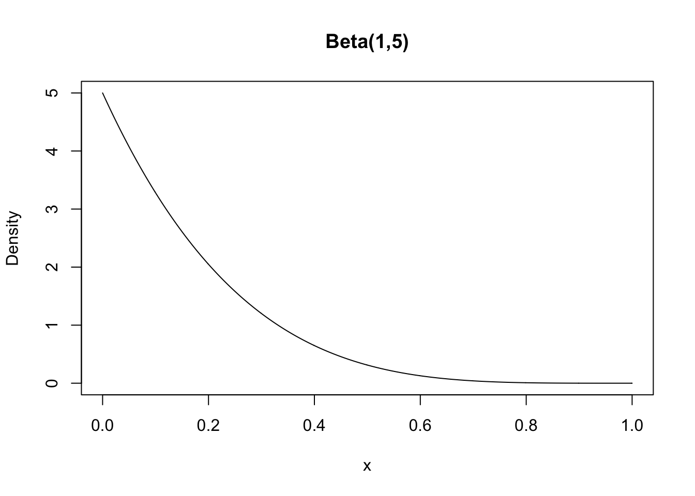

## Credible Intervals and Predictive Inference

Missing: JAGS plot for 2.3.1

### Non-Conjugate Priors

In many applications, a Bayesian may not be able to use a conjugate prior. Sometimes she may want to use a reference prior, which injects the minimum amount of personal belief into the analysis. But most often, a Bayesian will have a personal belief about the problem that cannot be expressed in terms of a convenient conjugate prior. 

For example, we shall reconsider the RU-486 case from earlier in which four children were born to standard therapy mothers. But no children were born to RU-486 mothers. This time, the Bayesian believes that the probability p of an RU-486 baby is uniformly distributed between 0 and one-half, but has a point mass of 0.5 at one-half. That is, she believes there's a 50% chance that there is no difference between standard therapy and RU-486. But if there is a difference, she thinks that RU-486 is better, but she is completely unsure about how much better it would be. 

In mathematical notation, the probability density function of $p$ is

$$f_p(x) = \left\{ \begin{array}{ccc}
1 & \text{for} & 0 \leq x < 0.5 \\
1 & \text{for} & x = 0.5 \\
0 & \text{for} & x < 0 \text{ or } x > 0.5
\end{array}\right.$$

We can check that the area under the density curve, plus the amount of the point mass, equals 1. 

The cumulative distribution function of $p$ is 

$$F_p(p \leq x) = \left\{ \begin{array}{ccc}
0 & \text{for} & x < 0 \\
x & \text{for} & 0 \leq x < 0.5  \\
1 & \text{for} & x \geq 0.5
\end{array}\right.$$

Why would this be a reasonable prior for an analyst to self-elicit? One reason is that in clinical trials, there's actually quite a lot of preceding research on the efficacy of the drug. This research might be based on animal studies or knowledge of the chemical activity of the molecule. So the Bayesian might feel sure that there is no possibility that RU-486 is worse than the standard treatment. And her interest is on whether the therapies are equivalent and if not, how much better RU-486 is than the standard therapy. 

As previously mentioned, there is no way to compute the posterior distribution for $p$ in a simple or even a complex mathematical form. And that is why Bayesian inference languished for so many decades until computational power enabled numerical solutions. But now we have such tools, and one of them is called **JAGS (Just Another Gibbs Sampler)**.

If we apply JAGS to the RU-486 data with this non-conjugate prior, we can find the posterior distribution. At a high level, this program is defining the binomial probability, that is the likelihood of seeing 0 RU-486 children, which is binomial. And then it defines the prior by using a few tricks to draw from either a uniform on the interval from 0 to one-half, or else draw from the point mass at one-half. Then it calls the JAGS model function, and draws 5,000 times from the posterior and creates a histogram of the results. 

NEED TO GET THE JAGS PLOT HERE

That histogram is lightly smooth to generate the posterior density you see. There is still a point mass of probability at 0.5, but now it has less weight than before. Also, note how the data have changed the posterior away from the prior. The analyst sees a lot of probability under the curve near 0.2, but responds to the fact that no children were born to RU-486 mothers. 

This section is mostly a look-ahead to future material. We have seen that a Bayesian might reasonably employ a non-conjugate prior in a practical application. But then she will need to employ some kind of numerical computation to approximate the posterior distribution. Additionally, we have used a computational tool, JAGS, to approximate the posterior for $p$, and identified its three important elements, the probability of the data given $p$, that is the likelihood, and the prior, and the call to the Gibbs sampler. 

### Credible Intervals

In this section, we introduce credible intervals, the Bayesian alternative to confidence intervals. Let's start with the confidence intervals, which are the frequentist way to express uncertainty about an estimate of a population mean, a population proportion or some other parameter. 

A confidence interval has the form of an upper and lower bound.

$$L, U = \text{pe} \pm \text{se} \times \text{cv}$$

* L = lower, U = upper
* pe = point estimate, se = standard error, cv = critical value 

Most importantly, the interpretation of a 95% confidence interval on the mean is that **"95% of similarly constructed intervals will contain the true mean"**, not "the probability that true mean lies between $L$ and $U$ is 0.95".

The reason for this frequentist wording is that a frequentist may not express his uncertainty as a probability. The true mean is either within the interval or not, so the probability is zero or one. The problem is that the frequentist does not know which is the case. 

On the other hand, Bayesians have no such qualms. It is fine for us to say that **"the probability that the true mean is contained within a given interval is 0.95"**. To distinguish our intervals from confidence intervals, we call them **credible intervals**.

Recall the RU-486 example. When the analyst used the beta-binomial family, she took the prior as $p \sim \text{beta}(1,1)$, the uniform distribution, where $p$ is the probability of a child having a mother who received RU-486. 

After we observed four children born to mothers who received conventional therapy, her posterior is $p|x \sim \text{beta}(1,5)$. In Figure \@ref(fig:posterior), the posterior probability density for $\text{beta}(1,5)$ puts a lot of probability near zero and very little probability near one.

(\#fig:posterior)RU-486 Posterior

For the Bayesian, her 95% credible interval is just any $L$ and $U$ such that the posterior probability that $L < p < U$ is $0.95$. The shortest such interval is obviously preferable. 

To find this interval, the Bayesian looks at the area under the $\text{beta}(1,5)$ distribution, that lies to the left of a value x. 

The density of the $\text{beta}(1,5)$ is 
$$f(p) = 5 (1-p)^4 \text{ for } 0 \leq p \leq 1,$$

and the area under the density between $0$ and $x$ is
$$F(x) = 1 - (1-x)^5 \text{ for } 0 \leq p \leq 1.$$

The Bayesian can use this to find $L, U$ with area 0.95 under the density curve between them, i.e. $F(U) − F(L) = 0.95$. Note that the Bayesian credible interval is asymmetric, unlike the symmetric confidence intervals that frequentists often obtain. It turns out that $L = 0$ and $U = 0.45$ is the shortest interval with probability 0.95 of containing $p$. 

What have we done? We have seen the difference in interpretations between the frequentist confidence interval and the Bayesian credible interval. Also, we have seen the general form of a credible interval. Finally, we have done a practical example constructing a 95% credible interval for the RU-486 data set. 

### Predictive Inference
