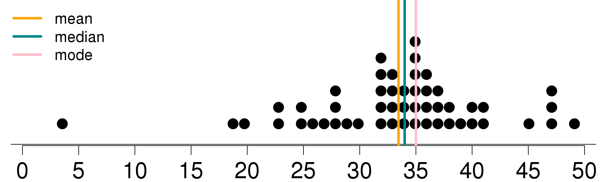
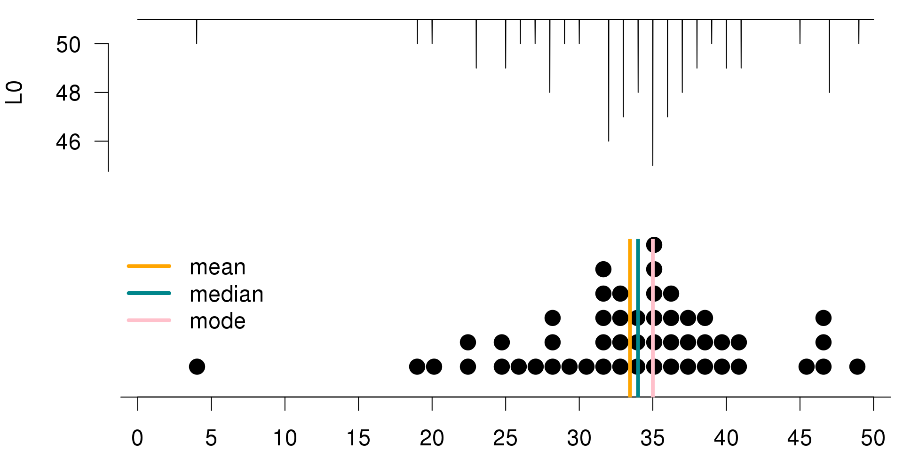
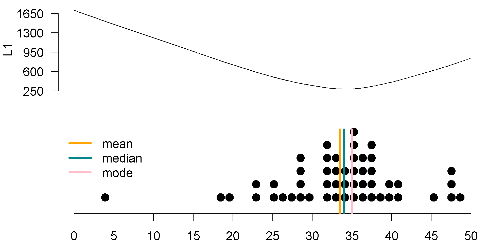
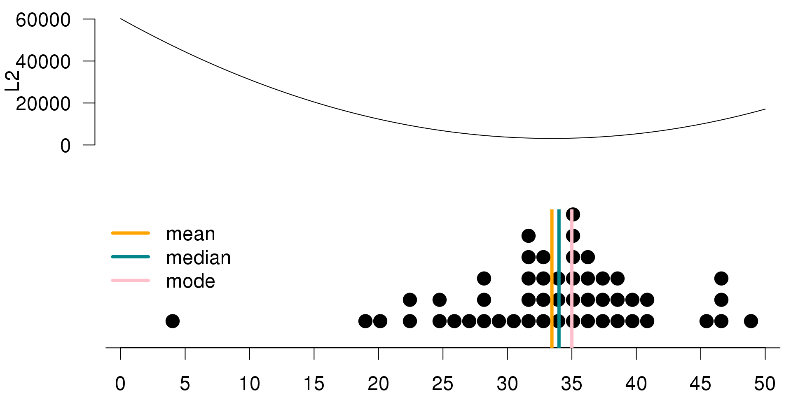

## Losses and Decision Making

To a Bayesian, the posterior distribution is the basis of any inference, since it integrates both his/her prior opinions and knowledge and the new information provided by the data. It also contains everything she believes about the distribution of the unknown parameter of interest. 

However, the posterior distribution on its own is not always sufficient. Sometimes the inference we want to express is a **credible interval**, because it indicates a range of likely values for the parameter. That would be helpful if you wanted to say that you are **95% certain** the probability of an RU-486 pregnancy lies between some number $L$ and some number $U$. And on other occasions, one needs to make a single number guess about the value of the parameter. For example, you might want to declare the average payoff for an insurance claim or tell a patient how much longer he/she has to live. 

Therefore, the Bayesian perspective leads directly to **decision theory**. And in decision theory, one seeks to minimize one's expected loss. 

### Loss Functions

Quantifying the loss can be tricky, and Table \@ref(tab:loss-functions) summarizes three different examples with three different loss functions.

If you're declaring the average payoff for an insurance claim, and if you are **linear** in how you value money, that is, twice as much money is exactly twice as good, then one can prove that the optimal one-number estimate is the **median** of the posterior distribution. But in different situations, other measures of loss may apply. 

If you are advising a patient on his/her life expectancy, it is easy to imagine that large errors are far more problematic than small ones. And perhaps the loss increases as the **square** of how far off your single number estimate is from the truth. For example, if she's told that her average life expectancy is two years, and it is actually ten, then her estate planning will be catastrophically bad, and she will die in poverty. In the case when the loss is proportional to the **quadratic** error, one can show that the optimal one-number estimate is the **mean** of the posterior distribution. 

Finally, in some cases, the penalty is 0 if you are exactly correct, but constant if you're at all wrong. This is the case with the old saying that close only counts with horseshoes and hand grenades; i.e., coming close but not succeeding is not good enough. And it would apply if you want a prize for correctly guessing the number of jelly beans in a jar. Here, of course, instead of minimizing expected losses, we want to **maximize the expected gain**. If a Bayesian is in such a situation, then his/her best one-number estimate is the **mode** of his/her posterior distribution, which is the most likely value. 

There is a large literature on decision theory, and it is directly linked to risk analysis, which arises in many fields. Although it is possible for frequentists to employ a certain kind of decision theory, it is much more natural for Bayesians. 

Table: (\#tab:loss-functions)Loss Functions

   Loss       Best Estimate 
-----------  ---------------
  Linear         Median     
 Quadratic        Mean      
    0/1           Mode      

When making point estimates of unknown parameters, we should make the choices that minimize the loss. Nevertheless, the best estimate depends on the kind of loss function we are using, and we will discuss in more depth how these best estimates are determined in the next section.

### Working with Loss Functions

Now we illustrate why certain estimates minimize certain loss functions. 

\BeginKnitrBlock{example}
<strong>(\#ex:car) </strong>You work at a car dealership. Your boss wants to know how many cars the dealership will sell per month. An analyst who has worked with past data from your company provided you a distribution that shows the probability of number of cars the dealership will sell per month. In Bayesian lingo, this is called the posterior distribution. A dot plot of that posterior is shown in Figure \@ref(fig:posterior-decision). The mean, median and the mode of the distribution are also marked on the plot. Your boss doesn't know any Bayesian statistics though, so he/she wants you to report **a single number** for the number of cars the dealership will sell per month.
\EndKnitrBlock{example}

(\#fig:posterior-decision)Posterior

Suppose your single guess is 30, and we call this $g$ in the following calculations. If your loss function is $L_0$ (i.e., a 0/1 loss), then you lose a point for each value in your posterior that differs from your guess and do not lose any points for values that exactly equal your guess. The total loss is the sum of the losses from each value in the posterior.

In mathematical terms, we define $L_0$ (0/1 loss) as

$$L_{0,i}(0,g) = \left\{ \begin{array}{cc}
0 & \text{if } g=x_i \\ 1 & \text{otherwise}
\end{array}\right.$$

The total loss is $L_0 = \sum_i L_{0,i}(0,g)$.

Let's calculate what the total loss would be if your guess is 30. Table \@ref(tab:L0-table) summarizes the values in the posterior distribution sorted in descending order. 

The first value is 4, which is not equal to your guess of 30, so the loss for that value is 1. The second value is 19, also not equal to your guess of 30, and the loss for that value is also 1. The third value is 20, also not equal to your guess of 30, and the loss for this value is also 1.

There is only one 30 in your posterior, and the loss for this value is 0 -- since it's equal to your guess (good news!). The remaining values in the posterior are all different than 30 hence, the loss for them are all ones as well. 

To find the total loss, we simply sum over these individual losses in the posterior distribution with 51 observations where only one of them equals our guess and the remainder are different. Hence, the total loss is 50. 

Figure \@ref(fig:L0-mode) is a visualization of the posterior distribution, along with the 0-1 loss calculated for a series of possible guesses within the range of the posterior distribution. To create this visualization of the loss function, we went through the process we described earlier for a guess of 30 for all guesses considered, and we recorded the total loss. We can see that the loss function has the lowest value when $g$, our guess, is equal to **the most frequent observation** in the posterior. Hence, $L_0$ is minimized at the **mode** of the posterior, which means that if we use the 0/1 loss, the best point estimate is the mode of the posterior. 

Table: (\#tab:L0-table)L0: 0/1 loss for g = 30

 i      x_i     L0: 0/1 
----  -------  ---------
 1       4         1    
 2      19         1    
 3      20         1    
        ...       ...   
 14     30         0    
        ...       ...   
 50     47         1    
 51     49         1    
       Total      50    

(\#fig:L0-mode)L0 is minimized at the mode of the posterior

Let's consider another loss function. If your loss function is $L_1$ (i.e., linear loss), then the total loss for a guess is the sum of the **absolute values** of the difference between that guess and each value in the posterior. Note that the absolute value function is required, because overestimates and underestimates do not cancel out.

In mathematical terms, $L_1$ (linear loss) is calculated as $L_1(g) = \sum_i |x_i - g|$.

We can once again calculate the total loss under $L_1$ if your guess is 30. Table \@ref(tab:L1-table) summarizes the values in the posterior distribution sorted in descending order.

The first value is 4, and the absolute value of the difference between 4 and 30 is 26. The second value is 19, and the absolute value of the difference between 19 and 30 is 11. The third value is 20 and the absolute value of the difference between 20 and 30 is 10. 

There is only one 30 in your posterior, and the loss for this value is 0 since it is equal to your guess. The remaining value in the posterior are all different than 30 hence their losses are different than 0. 

To find the total loss, we again simply sum over these individual losses, and the total is to 346. 

Again, Figure \@ref(fig:L1-median) is a visualization of the posterior distribution, along with a linear loss function calculated for a series of possible guesses within the range of the posterior distribution. To create this visualization of the loss function, we went through the same process we described earlier for all of the guesses considered. This time, the function has the lowest value when $g$ is equal to the **median** of the posterior. Hence, $L_1$ is minimized at the **median** of the posterior one other loss function. 

Table: (\#tab:L1-table)L1: linear loss for g = 30

 i      x_i     L1: |x_i-30| 
----  -------  --------------
 1       4           1       
 2      19           1       
 3      20           1       
        ...         ...      
 14     30           0       
        ...         ...      
 50     47           1       
 51     49           1       
       Total        346      

(\#fig:L1-median)L1 is minimized at the median of the posterior

If your loss function is $L_2$ (i.e. a squared loss), then the total loss for a guess is the sum of the squared differences between that guess and each value in the posterior. 

We can once again calculate the total loss under $L_2$ if your guess is 30. Table \@ref(tab:L2-table) summarizes the posterior distribution again, sorted in ascending order. 

The first value is 4, and the squared difference between 4 and 30 is 676. The second value is 19, and the square of the difference between 19 and 30 is 121. The third value is 20, and the square difference between 20 and 30 is 100. 

There is only one 30 in your posterior, and the loss for this value is 0 since it is equal to your guess. The remaining values in the posterior are again all different than 30, hence their losses are all different than 0.

To find the total loss, we simply sum over these individual losses again and the total loss comes out to 3,732. We have the visualization of the posterior distribution. Again, this time along with the squared loss function calculated for a possible serious of possible guesses within the range of the posterior distribution. 

Creating the visualization in Figure \@ref(fig:L2-mean) had the same steps. Go through the same process described earlier for a guess of 30, for all guesses considered, and record the total loss. This time, the function has the lowest value when $g$ is equal to the **mean** of the posterior. Hence, $L_2$ is minimized at the **mean** of the posterior distribution.

Table: (\#tab:L2-table)L2: squared loss for g = 30

 i      x_i     L2: (x_i-30)^2 
----  -------  ----------------
 1       4            1        
 2      19            1        
 3      20            1        
        ...          ...       
 14     30            0        
        ...          ...       
 50     47            1        
 51     49            1        
       Total         3732      

(\#fig:L2-mean)L2 is minimized at the mean of the posterior

To sum up, the point estimate to report to your boss about the number of cars the dealership will sell per month **depends on your loss function**. In any case, you will choose to report the estimate that minimizes the loss. 

* $L_0$ is minimized at the **mode** of the posterior distribution.
* $L_1$ is minimized at the **median** of the posterior distribution.
* $L_2$ is minimized at the **mean** of the posterior distribution.

### Minimizing Expected Loss for Hypothesis Testing

In Bayesian statistics, the inference about a parameter is made based on the posterior distribution, and let's include this in the hypothesis test setting.

Suppose we have two competing hypothesis, $H_1$ and $H_2$. Then we get

* $P(H_1 \text{ is true } | \text{ data})$ = posterior probability of $H_1$
* $P(H_2 \text{ is true } | \text{ data})$ = posterior probability of $H_2$

One straightforward way of choosing between $H_1$ and $H_2$ would be to **choose the one with the higher posterior probability**. In other words, the potential decision criterion is to

* Reject $H_1$ if $P(H_1 \text{ is true } | \text{ data}) < P(H_1 \text{ is true } | \text{ data})$.

However, since hypothesis testing is a decision problem, we should also consider a loss function. Let's revisit the HIV testing example in Section \@ref(sec:diagnostic-testing), and suppose we want to test the two competing hypotheses below:

* $H_1$: Patient does not have HIV
* $H_2$: Patient has HIV

These are the only two possibilities, so they are mutually exclusive hypotheses that cover the entire decision space. 

We can define the loss function as $L(d)$ -- the loss that occurs when decision $d$ is made. Then the Bayesian testing procedure minimizes the posterior expected loss. 

The possible decisions (actions) are:

* $d_1$: Choose $H_1$ - decide that the patient does not have HIV
* $d_2$: Choose $H_2$ - decide that the patient has HIV

For each decision $d$, we might be right, or we might be wrong. If the decision is right, the loss $L(d)$ associated with the decision $d$ is zero, i.e. no loss. If the decision is wrong, the loss $L(d)$ associated with the decision $d$ is some positive value $w$.

For $d=d_1$, we have

* **Right**: Decide patient does not have HIV, and indeed they do not. $\Rightarrow L(d_1) = 0$
* **Wrong**: Decide patient does not have HIV, but they do. $\Rightarrow L(d_1) = w_1$

For $d=d_2$, we also have

* **Right**: Decide patient has HIV, and indeed they do. $\Rightarrow L(d_2) = 0$
* **Wrong**: Decide patient has HIV, but they don’t $\Rightarrow L(d2) = w_2$

The consequences of making a wrong decision $d_1$ or $d_2$ are different. 

Wrong $d_1$ is a **false negative**:

* We decide that patient does not have HIV when in reality they do.
* Potential consequences: no treatment and premature death! (severe)

Wrong $d_2$ is a **false positive**:

* We decide that the patient has HIV when in reality they do not.
* Potential consequences: distress and unnecessary further investigation. (not ideal but less severe than the consequences of a false negative decision)

Let's put these definitions in the context of the HIV testing example with ELISA. 

**Hypotheses**

* $H_1$: Patient does not have HIV
* $H_2$: Patient has HIV

**Decision**

* $d_1$: Choose $H_1$ - decide that the patient does not have HIV
* $d_2$: Choose $H_2$ - decide that the patient has HIV

**Losses**

* $L(d_1) = \left\{ \begin{array}{cc}
0 & \text{if $d_1$ is right}\\
w_1=1000 & \text{if $d_1$ is wrong}
\end{array}\right.$

* $L(d_2) = \left\{ \begin{array}{cc}
0 & \text{if $d_2$ is right}\\
w_2=10 & \text{if $d_2$ is wrong}
\end{array}\right.$

The values of $w_1$ and $w_2$ are arbitrarily chosen. But the important thing is that $w_1$, the loss associated with a false negative determination, is much higher than $w_2$, the loss associated with a false positive determination.

**Posteriors**

The plus sign means that our patient had tested positive on the ELISA. 

* $P(H_1|+) \approx 0.88$ - the posterior probability of the patient **not** having HIV given positive ELISA result
* $P(H_2|+) \approx 0.12$ - the posterior probability of the patient having HIV given positive ELISA result, as the complement value of $P(H_1|+)$

**Expected losses**

* $E[L(d_1)] = 0.88 \times 0 + 0.12 \times 1000 = 120$
* $E[L(d_2)] = 0.88 \times 10 + 0.12 \times 0 = 8.8$

Since the expected loss for $d_2$ is lower, we should make this decision -- the patient has HIV. 

Note that our decision is highly influenced by the losses we assigned to $d_1$ and $d_2$. 

If the losses were symmetric, say $w_1 = w_2 = 10$, then the expected loss for $d_1$ becomes

$$E[L(d_1)] = 0.88 \times 0 + 0.12 \times 10 = 1.2,$$

while the expected loss for $d_2$ would not change. Therefore, we would choose $d_1$ instead; that is, we would decide that the patient does not have HIV. 

To recap, Bayesian methodologies allow for the integration of losses into the decision making framework easily. And in Bayesian testing, we minimize the posterior expected loss. 

### Posterior Probabilities of Hypotheses and Bayes Factors

In this section, we will continue with the HIV testing example to introduce the concept of Bayes factors. Earlier, we introduced the concept of priors and posteriors. The **prior odds** is defined as **the ratio of the prior probabilities of hypotheses**.

Therefore, if there are two competing hypotheses being considered, then the prior odds of $H_1$ to $H_2$ can be defined as $O[H_1:H_2]$, which is equal to $P(H_1)$ over probability of $P(H_2)$. In mathematical terms,

$$O[H_1:H_2] = \frac{P(H_1)}{P(H_2)}$$

Similarly, the **posterior odds** is **the ratio of the two posterior probabilities of hypotheses**, written as

$$PO[H_1:H_2] = \frac{P(H_1|\text{data})}{P(H_2|\text{data})}$$

Using Bayes' rule, we can rewrite the posterior probabilities as below:

$$\begin{align}
PO[H_1:H_2] &= \frac{P(H_1|\text{data})}{P(H_2|\text{data})} \\
&= \frac{(P(\text{data}|H_1) \times P(H_1)) / P(\text{data}))}{(P(\text{data}|H_2) \times P(H_2)) / P(\text{data}))} \\
&= \frac{(P(\text{data}|H_1) \times P(H_1))}{(P(\text{data}|H_2) \times P(H_2))} \\
&= \boxed{\frac{P(\text{data}|H_1)}{P(\text{data}|H_2)}} \times \boxed{\frac{P(H_1)}{P(H_2)}} \\
&= \textbf{Bayes factor} \times \textbf{prior odds}
\end{align}$$

In mathematical notation, we have

$$PO[H_1:H_2] = BF[H_1:H_2] \times O[H_1:H_2]$$

In other words, the posterior odds is the product of the Bayes factor and the prior odds for these two hypotheses. 

The Bayes factor quantifies the evidence of data arising from $H_1$ versus $H_2$. 

In a discrete case, the Bayes factor is simply the ratio of the likelihoods of the observed data under the two hypotheses, written as

$$BF[H_1:H_2] = \frac{P(\text{data}|H_1)}{P(\text{data}|H_2)}.$$

On the other hand, in a continuous case, the Bayes factor is the ratio of the marginal likelihoods, written as

$$BF[H_1:H_2] = \frac{\int P(\text{data}|\theta,H_1)d\theta}{\int P(\text{data}|\theta,H_2)d\theta}.$$

Note that $\theta$ is the set formed by all possible values of the model parameters.

In this section, we will stick with the simpler discrete case. And in upcoming sections, we will revisit calculating Bayes factors for more complicated models. 

Let's return to the HIV testing example from earlier, where our patient had tested positive in the ELISA. 

**Hypotheses**

* $H_1$: Patient does not have HIV
* $H_2$: Patient has HIV

**Priors**

The prior probabilities we place on these hypothesis came from the prevalence of HIV at the time in the general population. We were told that the prevalence of HIV in the population was 1.48 out of 1000, hence the prior probability assigned to $H_2$ is 0.00148. And the prior assigned to $H_1$ is simply the complement of this.

* $P(H_1) = 0.99852$ and $P(H_2) = 0.00148$

The prior odds are

* $O[H_1:H_2] = \dfrac{P(H_1)}{P(H_2)} = \dfrac{0.99852}{0.00148} = 674.6757$

**Posteriors**

Given a positive ELISA result, the posterior probabilities of these hypotheses can also be calculated, and these are approximately 0.88 and 0.12. We will hold on to more decimal places in our calculations to avoid rounding errors later. 

* $P(H_1|+) = 0.8788551$ and $P(H_2|+) = 0.1211449$

The posterior odds are

* $PO[H_1:H_2] = \dfrac{P(H_1|+)}{P(H_2|+)} = \dfrac{0.8788551}{0.1211449} = 7.254578$

**Bayes Factor**

Finally, we can calculate the Bayes factor as the ratio of the posterior odds to prior odds, which comes out to approximately 0.0108. Note that in this simple discrete case the Bayes factor, it simplifies to the ratio of the likelihoods of the observed data under the two hypotheses.

$$\begin{align}
BF[H_1:H_2] &= \frac{PO[H_1:H_2]}{O[H_1:H_2]} = \frac{7.25457}{674.6757} \approx 0.0108 \\
&= \frac{P(+|H_1)}{P(+|H_2)} = \frac{0.01}{0.93} \approx 0.0108
\end{align}$$

Alternatively, remember that the true positive rate of the test was 0.93 and the false positive rate was 0.01. Using these two values, the Bayes factor also comes out to approximately 0.0108.

So now that we calculated the Bayes factor, the next natural question is, what does this number mean? A commonly used scale for interpreting Bayes factors is proposed by @jeffreys1961theory, as in Table \@ref(tab:jeffreys1961). If the Bayes factor is between 1 and 3, the evidence against $H_2$ is not worth a bare mention. If it is 3 to 20, the evidence is positive. If it is 20 to 150, the evidence is strong. If it is greater than 150, the evidence is very strong. 

Table: (\#tab:jeffreys1961)Interpreting the Bayes factor

 BF[H_1:H_2]      Evidence against H_2   
-------------  --------------------------
   1 to 3       Not worth a bare mention 
   3 to 20              Positive         
  20 to 150              Strong          
    > 150             Very strong        

It might have caught your attention that the Bayes factor we calculated does not even appear on the scale. To obtain a Bayes factor value on the scale, we will need to change the order of our hypotheses and calculate $BF[H_2:H_1]$, i.e. the Bayes factor for $H_2$ to $H_1$. Then we look for evidence against $H_1$ instead. 

We can calculate $BF[H_2:H_1]$ as a reciprocal of $BF[H_1:H_2]$ as below: 

$$BF[H_2:H_1] = \frac{1}{BF[H_1:H_2]} = \frac{1}{0.0108} = 92.59259$$

For our data, this comes out to approximately 93. Hence the evidence against $H_1$ (the patient does not have HIV) is strong. Therefore, even though the posterior  for having HIV given a positive result, i.e. $P(H_2|+)$, was low, we would still decide that the patient has HIV, according to the scale based on a positive ELISA result.

An intuitive way of thinking about this is to consider not only the posteriors, but also the priors assigned to these hypotheses. Bayes factor is the ratio of the posterior odds to prior odds. While 12% is a low posterior probability for having HIV given a positive ELISA result, this value is still much higher than the overall prevalence of HIV in the population (in other words, the prior probability for that hypothesis).

Another commonly used scale for interpreting Bayes factors is proposed by @kass1995bayes, and it deals with the natural logarithm of the calculated Bayes factor. The values can be interpreted in Table \@ref(tab:kass1995).

Table: (\#tab:kass1995)Interpreting the Bayes factor

 2*log(BF[H_2:H_1])      Evidence against H_1   
--------------------  --------------------------
       0 to 2          Not worth a bare mention 
       2 to 6                  Positive         
      6 to 10                   Strong          
        > 10                 Very strong        

Reporting of the log scale can be helpful for numerical accuracy reasons when the likelihoods are very small. Taking two times the natural logarithm of the Bayes factor we calculated earlier, we would end up with the same decision that the evidence against $H_1$ is strong.

$$2 \times \log(92.59259) = 9.056418$$

To recap, we defined prior odds, posterior odds, and the Bayes factor. We learned about scales by which we can interpret these values for model selection. We also re-emphasize that in Bayesian testing, the order in which we evaluate the models of hypotheses does **not** matter. The Bayes factor of $H_2$ versus $H_1$, $BF[H_2:H_1]$, is simply the reciprocal of the Bayes factor for $H_1$ versus $H_2$, that is, $BF[H_1:H_2]$.
