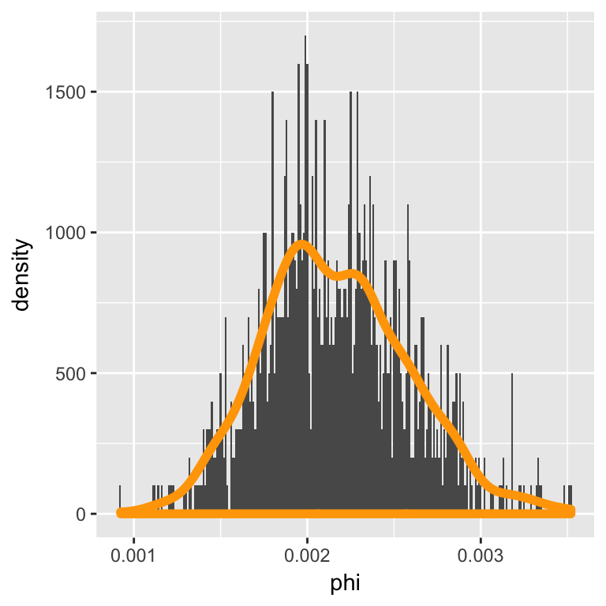
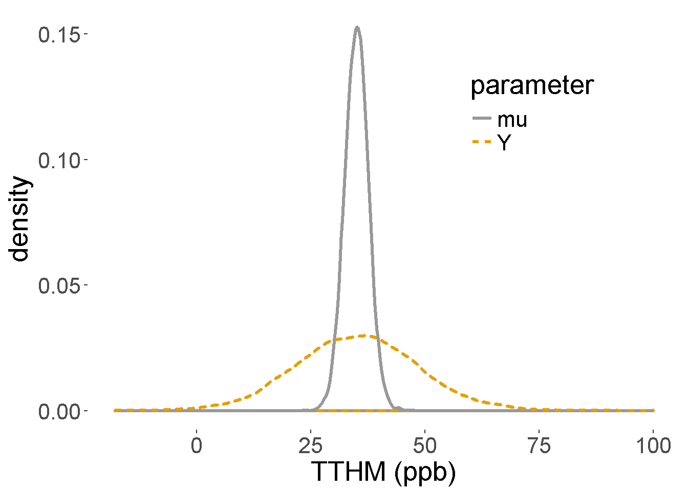
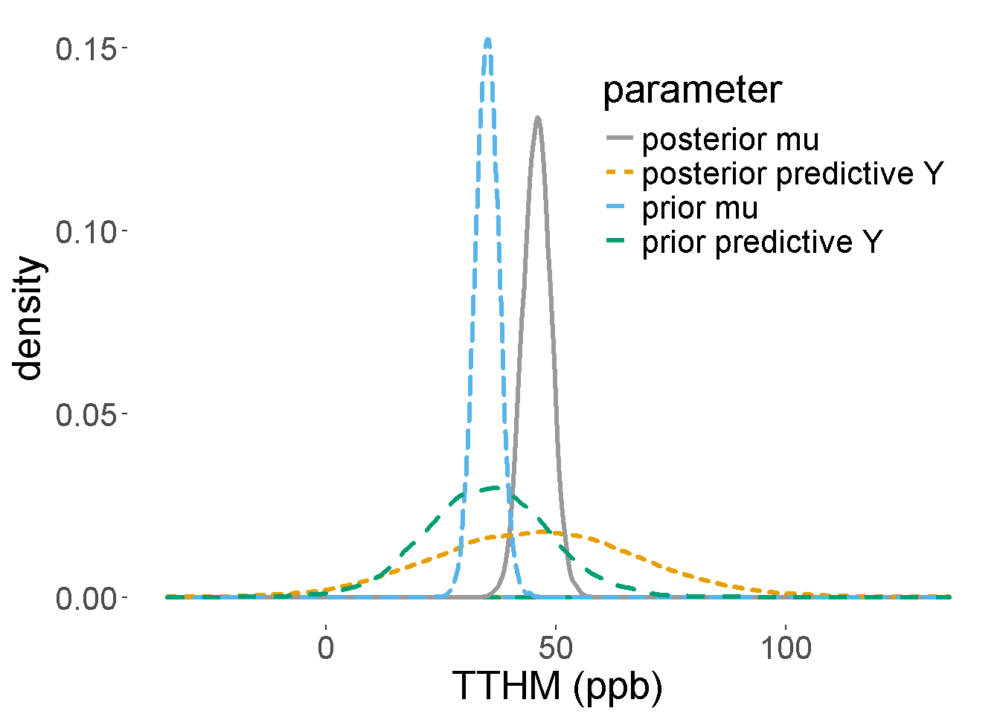
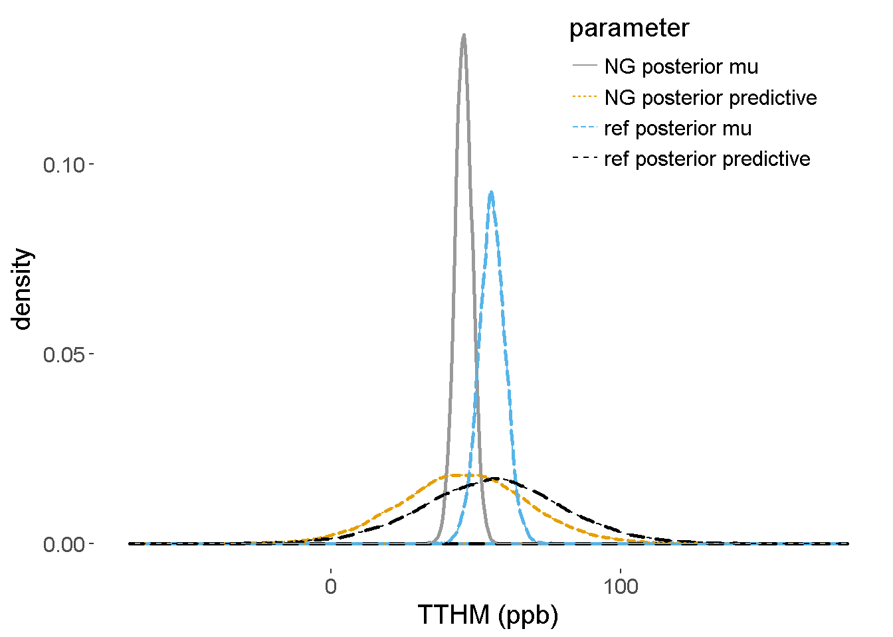
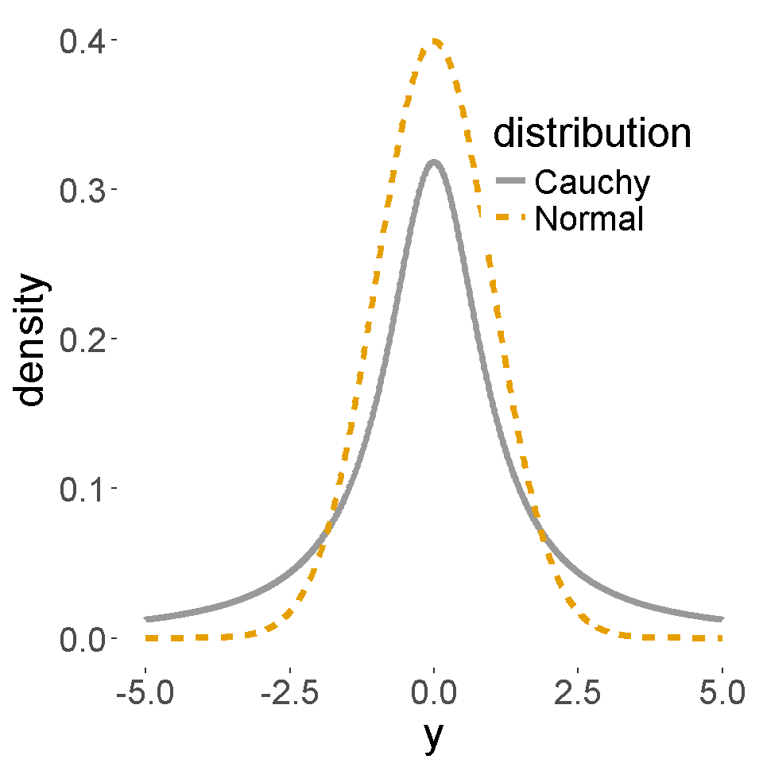
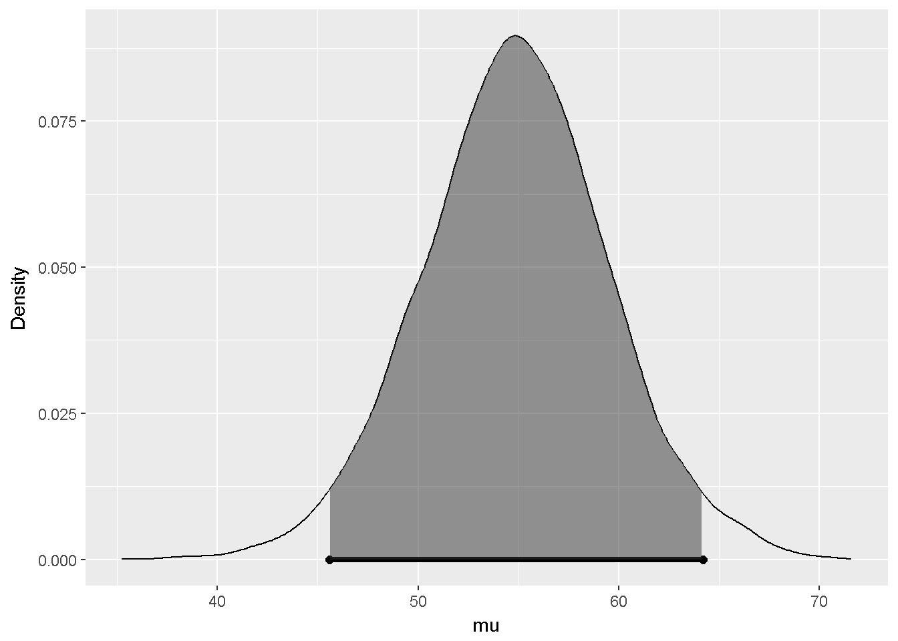
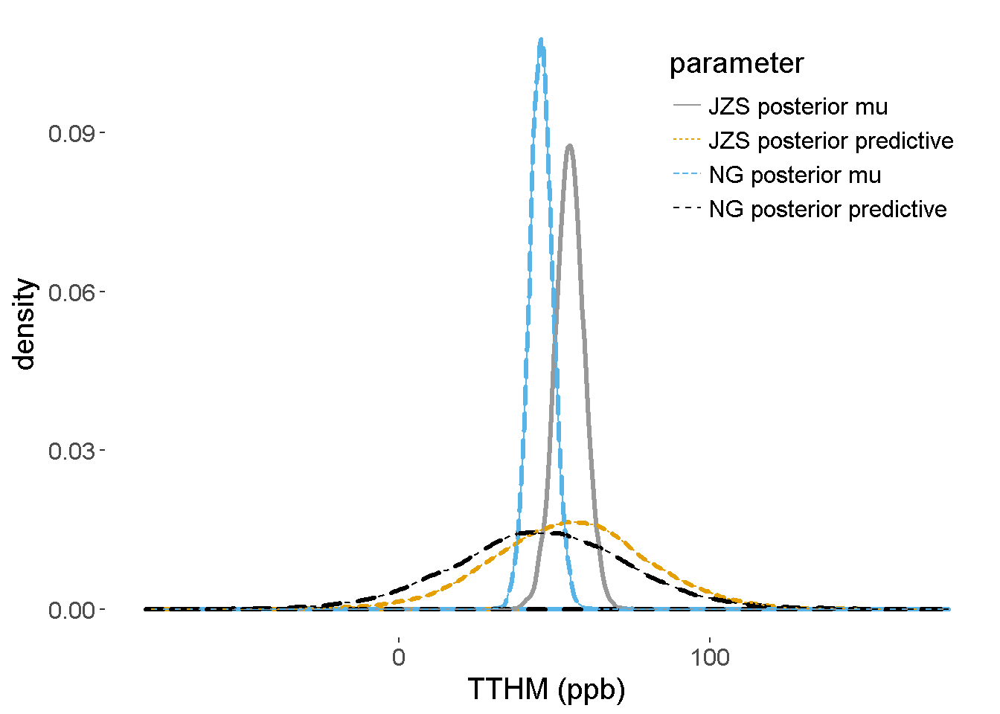

## Inference and Decision-Making with Multiple Parameters

This section is focused on the extending the Normal-Normal conjugate family introduced in \@ref(sec:normal-normal) to the problem of inference in a Normal population with an unknown mean and variance.  We will introduce the Normal-Gamma conjugate family for inference about the unknown mean and variance and will present Monte Carlo simulation for inference about functions of the parameters as well as sampling from predictive distributions, which can assist with prior elucidation. For situations when limited prior information is available, we discuss a limiting case of the Normal-Gamma conjugate family, leading to priors that can be used for a reference analysis.  Finally, we will show how to create a more flexible and robust prior distribution by using  mixtures of the  Normal-Gamma conjugate prior.  For inference in this case we will introduce Markov Chain Monte Carlo, a powerful simulation method for Bayesian inference.   

It is assumed that the readers have mastered the concepts of one-parameter Normal-Normal conjugate priors. Calculus is not required for this section; however, for those who are comfortable with calculus and would like to go deeper, we shall present starred sections with more details on the derivations. 

### The Normal-Gamma Conjugate Family {#sec:normal-gamma}


In \@ref(sec:normal-normal) we described the normal-normal conjugate  family for inference about an unknown mean $\mu$ with a known standard deviation $\sigma$ when the data were assumed to be a random sample from a normal population. In this section we will introduce the normal-gamma conjugate family for the common situation when $\sigma$ is unknown.  As both $\mu$ and $\sigma^2$ unknown, we will need to specify a **joint** prior distribution to describe our prior uncertainty about them.

**Sampling Model**

Recall that a conjugate pair is a sampling model for the data and prior distribution for the unknown parameters such that the posterior distribution is in the same family of distributions as the prior distribution. 
We will assume that the data are a random sample of size $n$ from a normal population with mean $\mu$ and variance $\sigma^2$; the following is a mathematical shorthand to represent this distribution assumption 

$$\begin{aligned}
Y_1, \ldots Y_n  \iid
\textsf{N}(\mu, \sigma^2) 
\end{aligned}$$
where the  'iid' above the distributed as symbol '$\sim$'  indicates that each of the observations are **i**ndependent of the others (given $\mu$ and $\sigma^2$) and are **i**dentically **d**istributed. 

**Conjugate prior**
Back in \@ref(sec:normal-normal), we found that with normal data, the conjugate prior for $\mu$ when the standard deviation $\sigma$ was known was a normal distribution.  We will build on this  to specify a conditional prior distribution for $\mu$ as 
\begin{equation}
\mu \mid \sigma^2   \sim  \textsf{N}(m_0, \sigma^2/n_0)
(\#eq:04-conjugate-normal)
\end{equation}
with hyper-parameters $m_0$, the prior mean for $\mu$, and $\sigma^2/n_0$ the prior variance.  While previously the variance was a known constant $\tau^2$, replacing $\tau^2$ with a multiple of $\sigma^2$ is needed for representing the joint conjugate prior for the mean and variance.   Because $\sigma$ has the same units as the data, the hyper-parameter $n_0$ is unitless, but is used to express our prior precision about $\mu$ with larger values of $n_0$ indicating more precision and smaller values less precision.  We will see later how the hyper-parameter $n_0$ may be interpreted as a prior sample size.  

As $\sigma^2$ is unknown, a Bayesian would use a
prior distribution to describe the uncertainty about the variance before seeing data.  Since the variance is non-negative, continuous, and with no upper limit,  a gamma distribution is a candidate  prior for the variance, based on the distributions that we have seen so far. However, that choice does not lead to a posterior distribution in the same family or that is recognizable as any common distribution. It turns out that the the inverse of the variance, which is known as the precision, has a conjugate gamma prior distribution.
Letting $\phi = 1/\sigma^2$ denote the precision or inverse variance,  the conjugate prior for $\phi$,
\begin{equation}
\phi \sim \textsf{Gamma}\left(\frac{v_0}{2}, \frac{v_0 s^2_0}{2} \right)
(\#eq:04-conjugate-gamma)
\end{equation}
is a gamma distribution with hyper-parameters $v_0$,  prior degrees of freedom, and $s^2_0$ a prior variance or guess for $\sigma^2$.  Equivalently we may say that the inverse of the variance has a 
$$1/\sigma^2 \sim \textsf{Gamma}(v_0/2, s^2_0 v_0/2)$$

gamma distribution to avoid using a new symbol.  Together the Normal conditional distribution for $\mu$ given $\sigma^2$ in \@ref(eq:04-conjugate-normal)  and the marginal Gamma distribution for $\phi$ in \@ref(eq:04-conjugate-gamma) lead to a joint distribution for the pair $(\mu, \phi)$ that we will call the Normal-Gamma family of distributions:
\begin{equation}(\mu, \phi) \sim \textsf{NormalGamma}(m_0, n_0, s^2_0, v_0)
(\#eq:04-conjugate-normal-gamma)
\end{equation}
with the four hyper-parameters $m_0$, $n_0$, $s^2_0$, and $v_0$.

**Posterior Distribution**

As a conjugate family, the posterior
distribution of the pair of parameters ($\mu, \phi$) is in the same family as the prior distribution when the sample data arise from a  normal distribution, that is the posterior is also Normal-Gamma 
\begin{equation}
(\mu, \phi) \mid \text{data} \sim \textsf{NormalGamma}(m_n, n_n, s^2_n, v_n)
\end{equation}
where the subscript $n$ on the
hyper-parameters indicates the updated values after seeing the $n$ observations. One attraction to conjugate families is there are relatively simple updating rules for obtaining the new hyper-parameters:
\begin{eqnarray*}
m_n & = & \frac{n \bar{Y} + n_0 m_0} {n + n_0}  \\
& \\
n_n & = & n_0 + n  \\
v_n & = & v_0 + n  \\
s^2_n & =  & \frac{1}{v_n}\left[s^2_0 v_0 + s^2 (n-1) + \frac{n_0 n}{n_n} (\bar{Y} - m_0)^2 \right]. 
\end{eqnarray*}
The updated hyper-parameter $m_n$ in the posterior distribution of $\mu$ is the posterior mean, which is a weighted average of the sample mean $\bar{Y}$ and prior mean $m_0$ with weights $n/(n + n_0$ and $n_0/(n + n_0)$ respectively and does not depend on $\sigma^2$.
The posterior sample size $n_n$ is the sum of the prior sample
size $n_n$ and the sample size $n$, representing the combined precision of the estimate for $\mu$.  The posterior degrees of freedom $v_n$ are also increased by adding the  sample size $n$ to the prior degrees of freedom $v_0$. Finally, the posterior variance hyper-parameter $s^2_n$ combines three sources of information about $\sigma$ in terms of sums of squared deviations. **FILL IN MORE DETAILS** The first term in
the square brackets is the sample variance times the sample degrees of
freedom which is the sample sum of squares. The second term represents
the prior sum of squares, while the third term is based on the squared
difference of the sample mean and prior mean.  We then divide by the
posterior degrees of freedom to get the new hyper-parameter.


The joint  Normal-Gamma distribution for the pair $\mu$ and
$\phi$, 
$$(\mu, \phi) \mid \data \sim \NoGa(m_n, n_n, s^2_n, v_n)$$
is equivalent to a **hierarchical model** specified in two stages with $\mu$ given $\sigma$
having a conditional normal distribution 
$$\mu \mid \data, \sigma^2  \sim  \No(m_n, \sigma^2/n_n)$$
and the inverse variance marginally
$$
1/\sigma^2 \mid \data   \sim   \Ga(v_n/2, s^2_n v_n/2) 
$$
having a gamma distribution.  We will see in the next section how this representation is convenient for generating samples from the posterior distribution.


**Marginal Distribution for $\mu$**

We are generally interested in inference about $\mu$ unconditionally
as $\sigma^2$ is unknown. This marginal inference requires the unconditional or marginal distribution of $\mu$ that `averages' over the uncertainty in $\sigma$. For continuous variables like $\sigma$, this averaging is performed by integration leading to the following result:  

$\mu$ given the data is a \index{Student t distribution}
$$ \mu \mid \data \sim \St(v_n, m_n, s^2_n/n_n)  $$ 
with density
\begin{equation}
p(\mu) =\frac{\Gamma\left(\frac{v_n + 1}{2} \right)}
{\sqrt{\pi v_n} \frac{s_n}{\sqrt{n_n}} \,\Gamma\left(\frac{v_n}{2} \right)}
\left(1 + \frac{1}{v_n}\frac{(\mu - m_n)^2} {s^2_n/n_n} \right)^{-\frac{v_n+1}{2}} 
(\#eq:Student-t-density)
\end{equation}
with the degrees of freedom $v_n$, a
location parameter $m_n$ and squared scale parameter that is the
posterior variance parameter divided by the posterior sample size. 
A standard Student $t$ random variable can be obtained by taking  $\mu$ and  subtracting the location $m_n$ and dividing by the scale 
$s_n/\sqrt{n}$:
$$ \frac{\mu - m_n}{s_n/\sqrt{n_n}} \equiv t \sim \St(v_n, 0 , 1)  $$
with degrees of freedom $v_n$, location  $0$ and scale $1$ in the
expression for the density in \@ref(eq:Student-t-density).
This latter representation allows us to use standard statistical functions for posterior inference such as finding credible intervals.

The Student $t$ distribution is similar to the normal distribution as it is symmetric and bell shaped, however, the __tails__ of the distribution are fatter or heavier than the normal distribution. The parameters $m_n$ and $s^2_n$ play similar roles in determining the center and spread of the distribution, as in the Normal distribution, however,  as Student $t$ distributions with degrees of freedom less than 3 do not have a mean or variance, the parameter $m_n$ is called the location or center of the distribution and the $s_n/\sqrt{n}$ is the scale.


**Example**

Let's look at an example based on a sample of total trihalomethanes or TTHM in tap water from a city in NC.  The data can be loaded from the `statsr` package


```r
library(statsr)
data(tapwater)
```


Using prior information about TTHM from the city, we will use a Normal-Gamma prior distribution,
$\textsf{NormalGamma}(35, 25, 156.25, 24)$ with
a prior mean of 35 parts per billion, a prior sample
size of 25, an estimate of the variance of 156.25 with degrees of freedom 24.  In section \@ref(sec:NG-predictive), we will describe how we arrived at these values.

Using the summaries of the data, $\bar{Y} = 55.5$,
variance $s^2 = 540.7$ and sample size of $n = 28$ with the
prior hyper-parameters from above, the posterior hyper-parameters are updated as follows:
\begin{eqnarray*}
n_n & = &  25 +  28 = 53\\
m_n  & = & \frac{28 \times55.5 + 25 \times35}{53} = 45.8  \\
v_n & = & 24 + 28 = 52  \\
s^2_n & = & \frac{(n-1) s^2 + v_0 s^2_0 + n_0 n (m_0 - \bar{Y})^2 /n_n }{v_n}  \\
  & = & \frac{1}{52}
     \left[27 \times 540.7 +
          24 \times 156.25  +
          \frac{25 \times 28}{53} \times (35 - 55.5)^2
\right] = 459.9  \\
\end{eqnarray*}
in the conjugate $\textsf{NormalGamma}(45.8, 53, 459.9, 52)$ 
posterior distribution that now summarizes our 
uncertainty about $\mu$ and $\phi$ ($\sigma^2$)  after seeing the data.

We can obtain the updated hyper-parameters in `R` using the following code in `R`

```r
# prior hyperparameters
m_0 = 35; n_0 = 25;  s2_0 = 156.25; v_0 = n_0 - 1
# sample summaries
Y = tapwater$tthm
ybar = mean(Y)
s2 = var(Y)
n = length(Y)
# posterior hyperparamters
n_n = n_0 + n
m_n = (n*ybar + n_0*m_0)/n_n
v_n = v_0 + n
s2_n = ((n-1)*s2 + v_0*s2_0 + n_0*n*(m_0 - ybar)^2/n_n)/v_n
```

**Credible intervals for $\mu$**

To find a credible interval for the mean $\mu$, we use the Student $t$
distribution.  Since the distribution of $\mu$ is unimodal and symmetric, the shortest 95 percent credible interval or the **Highest Posterior Density** interval, HPD for short,


is the orange interval given by the
Lower endpoint L and upper endpoint U where the probability that mu is
in the interval (L, U) is the shaded area which is equal to zero point
nine five.

using the standardized t distribution and some algebra, these values are
$$
\begin{aligned}
  L & =  m_n + t_{0.025}\sqrt{s^2_n/n_n}    \\
  U & =  m_n + t_{0.975}\sqrt{s^2_n/n_n}
\end{aligned}
$$
or the posterior mean (our point estimate) plus quantiles of the standard $t$ distribution times the scale.  Because of the symmetry in the Student $t$ distribution, the credible interval is $m_n \pm t_{0.975}\sqrt{s^2_n/n_n}$, which should look familiar to expressions for confidence intervals.

Using the following code in `R` the  95\%
credible interval for the tap water data is


```r
m_n + qt(c(0.025, 0.975), v_n)*sqrt(s2_n/n_n)
```

```
## [1] 39.93192 51.75374
```


Based on the updated posterior, we find that there is a 95 chance that
the mean TTHM concentration is between 39.9
parts per billion and 51.7 parts per billion.

**Summary**
The Normal-Gamma conjugate prior for
inference about an unknown mean and variance for samples from a normal
distribution allows simple expressions for updating prior beliefs given the data.   The joint Normal-Gamma distribution leads to the
Student $t$ distribution for inference about $\mu$ when $\sigma$ is unknown.  The Student $t$ distribution can be used to provide 
credible intervals for $\mu$  using `R` or other software that provides quantiles of a standard $t$ distribution.

For the energetic learner who is comfortable with calculus, the following optional material provides more details on how the posterior distributions were obtained and other results in this section.

For those that are ready to move on, we will introduce Monte Carlo sampling  in the next section; Monte Carlo Sampling is a simulation method that will allow us to approximate distributions of transformations of the parameters without using calculus or change of variables, as well as aid exploratory data analysis of the prior or posterior distribution.


**Details of Results (optional reading)**

TBA

### Monte Carlo Inference  {#sec:NG-MC}

In this section, we will illustrate Monte Carlo sampling from posterior distributions and how it can be used for inference. In Section \@ref(sec:normal-gamma), we can get the posterior distributions for the precision (inverse variance), and the mean given the precision. Then the marginal distribution of the mean can be obtained via integration.

Here is a recap of the joint posterior distribution for the mean $\mu$ and the precision $\phi = 1/\sigma^2$:

* Conditional posterior $\mu \mid \data, \sigma^2  \sim  \No(m_n, \sigma^2/n_n)$
* Marginal posterior $1/\sigma^2 = \phi \mid \data   \sim   \Ga(v_n/2,s^2_n v_n/2)$
* Marginal posterior $\mu \mid \data \sim \St(v_n, m_n, s^2_n/n_n)$

What if we are interested in the distribution of the standard deviation $\sigma$ itself, or other transformations of the parameters? There may not be a closed-form expression for the distributions.

However, it turns out that **Monte Carlo sampling** is an easy way to make inference, when we cannot analytically calculate distributions of parameters, expectations, or probabilities. Monte Carlo methods are computational algorithms that rely on repeated random sampling to calculate numerical results. The name refers to the famous Monte Carlo Casino in Monaco, home to games of chance such as Roulette.

Let's start with a case where we know the posterior distribution.


For posterior inference about the precision $\phi$ using Monte Carlo simulation, we generate $S$ random samples from the posterior distribution: 

$$\phi^{(1)},\phi^{(2)},\cdots,\phi^{(S)} \iid \Ga(v_n/2,s^2_n v_n/2)$$

The term **iid** stands for **i**ndependent and **i**dentically **d**istributed. In other words, the $S$ draws of $\phi$ are independent and identically distributed from the gamma distribution.

Then the empirical distribution of the $S$ samples is used to approximate the actual posterior distribution. From the samples, the sample mean of the draws of $\phi$ can be used to approximate the posterior mean of $\phi$. 

Likewise, we can calculate probabilities, quantiles and other functions using the samples from the posterior distribution. For example, if we want to calculate the posterior expectation of some function of $\phi$, written as $g(\phi)$, we can approximate that by taking the average of the function, and evaluate it at the $S$ draws of $\phi$, written as $\frac{1}{S}\sum^S_{i=1}g(\phi^{(i)})$.

The approximation improves as the size of the Monte Carlo simulation $S$ increases.

$$\frac{1}{S}\sum^S_{i=1}g(\phi^{(i)}) \rightarrow E(g(\phi \mid \data))$$

**Example**

We will apply this with the tap water example. To start, we will set a random seed, which allows the results to be replicated. To generate 1,000 draws from the gamma posterior distribution, we use the `rgamma` function `R` with the posterior hyperparameters from last time.


```r
set.seed(8675309)
phi = rgamma(1000, shape = v_n/2, rate=s2_n*v_n/2)
```

Figure \@ref(fig:phi-plot) shows the histogram of the 1,000 draws of $\phi$ generated from the Monte Carlo simulation, representing the empirical distribution. The orange line represents the actual gamma posterior density.

<div class="figure" style="text-align: center">

<p class="caption">(\#fig:phi-plot)Empirical distribution of the tap water example</p>
</div>

Try changing the random seed or increasing the number of simulations, and see how the approximation changes.

We will now use Monte Carlo simulations to approximate the distribution of $\sigma$. Since $\sigma = 1/\sqrt{\phi}$, we can apply the transformation to the 1,000 draws of $\phi$ to obtain a random sample of $\sigma$. We can then estimate the posterior mean of $\sigma$ by calculating the sample mean of the 1,000 draws. 


```r
sigma = 1/sqrt(phi)
mean(sigma) # posterior mean of sigma
```

```
## [1] 21.81346
```

Similarly, we can obtain a 95% credible interval for $\sigma$ by finding the sample quantiles of the distribution.


```r
quantile(sigma, c(0.025, 0.975))
```

```
##     2.5%    97.5% 
## 18.20655 26.53671
```

**Summary**

To recap, we have introduced the powerful method of Monte Carlo simulation for posterior inference. Monte Carlo methods provide estimates of expectations, probabilities, and quantiles of distributions from the simulated values. Monte Carlo simulation also allows us to approximate distributions of functions of the parameters, or the transformations of the parameters.

Next we will discuss predictive distributions and show how Monte Carlo simulation may be used to help choose prior hyperparameters, using the prior predictive distribution of data.

### Predictive Distributions {#sec:NG-predictive}

In this section, we will discuss prior and posterior **predictive** distributions of the data and show how Monte Carlo sampling from the prior predictive distribution can help select hyper parameters.

We can obtain the prior predictive distribution of the data, by taking the joint distribution of the data and the parameters in averaging over the possible values of the parameters from the prior.

* Prior:

$$ \begin{aligned}
\frac{1}{\sigma^2} = \phi &\sim \textsf{Gamma}\left(\frac{v_0}{2}, \frac{v_0 s^2_0}{2} \right) \\
\mu \mid \sigma^2  &\sim  \textsf{N}(m_0, \sigma^2/n_0)
\end{aligned} $$

* Sampling model:

$$Y_i \mid \mu,\sigma^2 \iid \No(\mu, \sigma^2) $$

* Prior predictive distribution for $Y$:

$$\begin{aligned}
p(Y) &= \iint p(Y \mid \mu,\sigma^2) p(\mu \mid \sigma^2) p(\sigma^2) d\mu \, d\sigma^2 \\
Y &\sim t(v_0, m_0, s_0^2+s_0^2/n_0)
\end{aligned}$$

This distribution of the observables can be used to help elicit prior hyper parameters as in the tap water example.

A report from the city water department suggests that levels of TTHM are expected to be between 10-60 parts per billion (ppb).

* Set the prior mean $\mu$ to be at the midpoint of the interval: $m_0 = (60+10)/2 = 35$

* Standard deviation: Based on the empirical rule, 95% observations are within $\pm 2\sigma$ of $\mu$, we expect that the range of the data should be $4\sigma$.
 
* Prior estimate of sigma: $s_0 = (60-10)/4 = 12.5$ or $s_0^2 = [(60-10)/4]^2 = 156.25$

To complete the specification, we also need to choose the prior sample size $n_0$ and degrees of freedom $v_0$. As the degrees of freedom of the variance are $n-1$, we set $v_0 = n_0 - 1$. We will draw samples from the prior predictive distribution and modify $n_0$ so that the simulated data agree with our prior assumptions.

The following `R` code shows a simulation from the predictive distribution with the prior sample size of 2. Please note that the number of Monte Carlo simulations should not be confused with the prior sample size $n_0$.

We begin by simulating $\phi$, transfering $\phi$ to calculate $\sigma$, and then simulating values of $\mu$. Finally, the simulated values of $\mu,\sigma$ are used to generate possible values of TTHM denoted by $Y$. 


```r
m_0 = (60+10)/2; s2_0 = ((60-10)/4)^2;
n_0 = 2; v_0 = n_0 - 1
set.seed(1234)
phi = rgamma(10000, v_0/2, s2_0*v_0/2)
sigma = 1/sqrt(phi)
mu = rnorm(10000, mean=m_0, sd=sigma/(sqrt(n_0)))
y = rnorm(10000, mu, sigma)
quantile(y, c(0.025,0.975))
```

```
##      2.5%     97.5% 
## -140.1391  217.7050
```

This forward simulation propagates uncertainty in $\mu,\sigma$ to the prior predictive distribution of the data. Calculating the sample quantiles from the samples of the prior predictive for $Y$, we see that the 95% predictive interval includes negative values. Since TTHM is non-negative, we need to adjust $n_0$ and repeat.

After some trial and error, we find that the prior sample size of 25 (in fact the Central Limit Theorem suggests at least 25 or 30 to be "sufficiently large"), the empirical quantiles from the prior predictive distribution are close to the range of 10 to 16 that we were given as prior information. 


```r
m_0 = (60+10)/2; s2_0 = ((60-10)/4)^2;
n_0 = 25; v_0 = n_0 - 1
set.seed(1234)
phi = rgamma(10000, v_0/2, s2_0*v_0/2)
sigma = 1/sqrt(phi)
mu = rnorm(10000, mean=m_0, sd=sigma/(sqrt(n_0)))
y = rnorm(10000, mu, sigma)
quantile(y, c(0.025,0.975))
```

```
##      2.5%     97.5% 
##  8.802515 61.857350
```

Figure \@ref(fig:hist-prior) shows an estimate of the prior distribution of $\mu$ in gray and the more dispersed prior predictive distribution in TTHM in orange, obtained from the Monte Carlo samples.

<div class="figure" style="text-align: center">

<p class="caption">(\#fig:hist-prior)Prior density</p>
</div>

Using the Monte Carlo samples, we can also estimate the prior probability of negative values of TTHM by counting the number of times the simulated values are less than zero out of the total number of simulations. 


```r
sum(y < 0)/length(y)  # P(Y < 0) a priori
```

```
## [1] 0.0049
```

With the normal prior distribution, this probability will never be zero, but may be acceptably small, so we can still use the conjugate normal gamma model for analysis. 

We can use the same strategy to generate samples from the predictive distribution of a new measurement $Y_{n+1}$ given the observed data. In mathematical terms, the posterior predictive distribution is written as

$$Y_{n+1} \mid Y_1, \ldots, Y_n \sim \St(v_n, m_n, s^2_n (1 + 1/n_n))$$

In the code, we replace the prior hyper parameters with the posterior hyper parameters from last time. 


```r
set.seed(1234)
phi = rgamma(10000, v_n/2, s2_n*v_n/2)
sigma = 1/sqrt(phi)
post_mu = rnorm(10000, mean=m_n, sd=sigma/(sqrt(n_n)))
pred_y =  rnorm(10000,post_mu, sigma)
quantile(pred_y, c(.025, .975))
```

```
##      2.5%     97.5% 
##  3.324087 89.871964
```

Figure \@ref(fig:hist-pred) shows the Monte Carlo approximation to the prior distribution of $\mu$, and the posterior distribution of $\mu$ which is shifted to the right. The prior and posterior predictive distributions are also depicted, showing how the data have updated the prior information.

<div class="figure" style="text-align: center">

<p class="caption">(\#fig:hist-pred)Posterior densities</p>
</div>

Using the Monte-Carlo samples from the posterior predictive distribution, we can estimate the probability that a new TTHM sample will exceed the legal limit of 80 parts per billion, which is approximately 0.06. 


```r
sum(pred_y > 80)/length(pred_y)  # P(Y > 80 | data)
```

```
## [1] 0.0623
```

By using Monte-Carlo methods, we can obtain prior and posterior predictive distributions of the data. 

* Sampling from the prior predictive distribution can help with the selection of prior hyper parameters and verify that these choices reflect the prior information that is available. 

* Visualizing prior predictive distributions based on Monte Carlo simulations can help explore implications of our prior assumptions such as the choice of the hyper parameters or even assume distributions. 

* If samples are incompatible with known information, such as support on positive values, we may need to modify assumptions and look at other families of prior distributions.

### Reference Priors  {#sec:NG-reference}

In Section \@ref(sec:NG-predictive), we described a way of specifying an informative prior distribution for inference about TTHM in tapwater based on additional prior information. We had to use a prior sample size that was comparable to the observed sample size for the prior predictive under the Normal-Gamma distribution to agree with the reported prior interval.

However, there may be cases where prior information is not available, or you may wish to present an objective analysis where minimal prior information is used. Or perhaps, you want to use the Bayesian paradigm to make probability statements about parameters, but not use any prior information. 

In this section, we will present reference priors for normal data, which can be viewed as a limiting form of the Normal-Gamma conjugate prior distribution. **Can you actually perform a Bayesian analysis without using prior information?**  

Conjugate priors can be interpreted to be based on a prior sample. What happens in the conjugate Normal-Gamma prior if we take our prior sample size $n_0$ to go to zero?  If we have no data, then we will define the prior sample variance $s_0^2$ to go to  0, and based on the relationship between prior sample sized and prior degrees of freedom, we will let the prior degrees of freedom go to the prior sample size minus one, or negative 1, i.e. $v_0 = n_0 - 1 \rightarrow -1$.

With this limit, we have the following properties:
  
* The posterior mean goes to the sample mean.

* The posterior sample size is the observed sample size.

* The posterior degrees of freedom go to the sample degrees of freedom.

* The posterior variance parameter goes to the sample variance.

In this limit, the posterior hyperparameters do not depend on the prior hyperparameters.

Since $n_0 \rightarrow 0, s^2_0 \rightarrow 0, v_0 = n_0 - 1 \rightarrow -1$, we have in mathematical terms:

$$\begin{aligned}
m_n &= \frac{n \bar{Y} + n_0 m_0} {n + n_0}  \rightarrow \bar{Y} \\
n_n &= n_0 + n  \rightarrow n \\
v_n &= v_0 + n  \rightarrow n-1 \\
s^2_n &= \frac{1}{v_n}\left[s^2_0 v_0 + s^2 (n-1) + \frac{n_0 n}{n_n} (\bar{Y} - m_0)^2 \right] \rightarrow s^2
\end{aligned}$$

This limiting Normal-gamma distribution, $\No-\Ga(0,0,0,-1)$, is not really a normal gamma distribution, as the density does not integrate to 1. The form of the limit can be viewed as a prior for $\mu$ that is proportional to a constant, or uniform/flat on the whole real line. And a prior for the variance is proportional to 1 over the variance. The joint prior is taken as the product of the two.


$$\begin{aligned}
p(\mu \mid \sigma^2) & \propto  1 \\
p(\sigma^2) & \propto  1/\sigma^2 \\
p(\mu, \sigma^2) & \propto  1/\sigma^2
\end{aligned}$$

This is refered to as a **reference prior** because the posterior hyperparameters do not depend on the prior hyperparameters.

In addition, $\textsf{NormalGamma}(0,0,0,-1)$ is a special case of a reference prior, known as the independent Jeffreys prior.  While Jeffreys used other arguments to arrive at the form of the prior, the goal was to have an **objective prior** invariant to shifting the data by a constant or multiplying by a constant. 

Now, a naive approach to constructing a non-informative distribution might be to use a uniform distribution to represent lack of knowledge. However, would you use a uniform distribution for $\sigma^2$, or a uniform distribution for the precision $1/\sigma^2$? Or perhaps a uniform distribution for $\sigma$? These would all lead to different posteriors with little justification for any of them. This ambiguity led Sir Harold Jeffreys to propose reference distributions for the mean and variance for situations where prior information was limited. These priors are **invariant** to the units of the data.

The unnormalized priors that do not integrate to a constant are called **improper distributions**. An important consideration in using them is that one cannot generate samples from the prior or the prior predictive distribution to data and are referred to as **non-generative distributions**.

While the reference prior is not a proper prior distribution, and cannot reflect anyone's actual prior beliefs, the formal application phase rule can still be used to show that **the posterior distribution is a valid normal gamma distribution**, leading to a formal phase posterior distribution. That depends only on summary statistics of the data.

The posterior distribution $\textsf{NormalGamma}(\bar{Y}, n, s^2, n-1)$ breaks down to

$$\begin{aligned}
\mu \mid \sigma^2, \data & \sim \No(\bar{Y}, \sigma^2/n) \\
1/\sigma^2  \mid \data & \sim \Ga((n-1)/2, s^2(n - 1)/2).
\end{aligned}$$

* Under the reference prior $p(\mu, \sigma^2) \propto 1/\sigma^2$, the posterior distribution  after standardizing $\mu$ has a Student $t$  distribution with n minus one degrees of freedom.

$$\frac{\mu - \bar{Y}}{\sqrt{s^2/n}} \mid \data \sim  \St(n-1, 0, 1)$$
* Prior to seeing the data, the distribution of the standardized sample mean given $\mu$ and $\sigma$ also has a Student t distribution.

$$\frac{\mu - \bar{Y}}{\sqrt{s^2/n}} \mid \mu, \sigma^2 \sim  \St(n-1, 0, 1) $$

* Both frequentist sampling distributions and Bayesian reference posterior distributions lead to intervals of this form: 

$$(\bar{Y} - t_{1 - \alpha/2} s/\sqrt{n}, \, \bar{Y} + t_{1 - \alpha/2} s/\sqrt{n})$$

* However, only the Bayesian approach justifies the probability statements about $\mu$ being in the interval after seeing the data.

$$P(\bar{Y} - t_{1 - \alpha/2} s/\sqrt{n} < \mu <  \bar{Y} + t_{1 - \alpha/2} s/\sqrt{n}) = 1 - \alpha$$

We can use either analytic expressions based on the t-distribution, or Monte Carlo samples from the posterior predictive distribution, to make predictions about a new sample.


Here is some code to generate the Monte Carlo samples from the tap water example:

```r
phi = rgamma(10000, (n-1)/2, s2*(n-1)/2)
sigma = 1/sqrt(phi)
post_mu = rnorm(10000, mean=ybar, sd=sigma/(sqrt(n)))
pred_y =  rnorm(10000,post_mu, sigma)
quantile(pred_y, c(.025, .975))
```

```
##       2.5%      97.5% 
##   6.692877 104.225954
```

Using the Monte Carlo samples, Figure \@ref(fig:plot-post-pred) shows the posterior distribution based on the informative Normal-Gamma prior and the reference prior. Both the posterior distribution for $\mu$ and the posterior predictive distribution for a new sample are shifted to the right, and are centered at the sample mean. The posterior for $\mu$ under the reference prior is less concentrated around its mean than the posterior under the informative prior, which leads to an increased posterior sample size and hence increased precision.

<div class="figure" style="text-align: center">

<p class="caption">(\#fig:plot-post-pred)Comparison of posterior densities</p>
</div>

The posterior probability that a new sample will exceed the legal limit of 80 ppb under the reference prior is roughly 0.15, which is more than double the probability of 0.06 from the posterior under the informative prior.


```r
sum(pred_y > 80)/length(pred_y)  # P(Y > 80 | data)
```

```
## [1] 0.1534
```

In constructing the informative prior from the reported interval, there are two critical assumptions. First, the prior data are exchangeable with the observed data. Second, the conjugate normal gamma distribution is suitable for representing the prior information. These assumptions may or may not be verifiable, but they should be considered carefully when using informative conjugate priors.

In the case of the tap water example, there are several concerns: One, it is unclear that the prior data are exchangeable with the observed data.  For example, water treatment conditions may have changed. Two, the prior sample size was not based on a real prior sample, but instead selected so that the prior predictive intervals under the normal gamma model agreed with the prior data.  As we do not have access to the prior data, we cannot check assumptions about normality that would help justify the prior. Other skewed distributions may be consistent with the prior interval, but lead to different conclusions.

To recap,  we have introduced a  reference prior for inference for
normal data with an unknown mean and variance. Reference priors are often part of a prior sensitivity study and are used when objectivity is of utmost importance.

If conclusions are fundamentally different with an informative prior and a reference prior, one may wish to carefully examine assumputions that led to the informative prior. 

* Is the prior information based on a prior sample that is exchangable with the observed data?  

* Is the normal-gamma assumption appropriate?  

Informative priors can provide more accurate inference when data are limited, and the transparency of explicitly laying out prior assumptions is an important aspect of reproducible research. However, one needs to be careful that certain prior assumptions may lead to un-intended consequences.

Next, we will investigate a prior distribution that is a mixture of
conjugate priors, so the new prior distribution provides robustness to prior mis-specification in the prior sample size.  

While we will no longer have nice analytical expressions for the posterior, we can simulate from the posterior distribution using a Monte Carlo algorithm
called Markov chain Monte Carlo (MCMC).

### Mixtures of Conjugate Priors  {#sec:NG-Cauchy}

In this section, we will describe priors that are constructed as a mixture of conjugate priors -- in particular, the Cauchy distribution. As these are no longer conjugate priors, nice analytic expressions for the posterior distribution are not available. However, we can use a Monte Carlo algorithm called Markov chain Monte Carlo (MCMC) for posterior inference.

In many situations, we may have reasonable prior information about the mean $\mu$, but we are less confident in how many observations our prior beliefs are equivalent to. We can address this uncertainty in the prior sample size, through an additional prior distribution on a $n_0$ via a hierarchical prior.

The hierarchical prior for the normal gamma distribution is written as
$$\begin{aligned}
\mu \mid \sigma^2, n_0 & \sim \No(m_0, \sigma^2/n_0) \\
n_0 \mid \sigma^2 &  \sim \Ga(1/2, r^2/2)
\end{aligned}$$

If $r=1$, then this corresponds to a prior expected sample size of one because the expectation of $\Ga(1/2,1/2)$ is one. 

The marginal prior distribution from $\mu$ can be attained via integration, and we get

$$\mu \mid \sigma^2  \sim  \Ca(m_0, \sigma^2 r^2)$$

This is a **Cauchy distribution** centered at the prior mean $m_0$, with the scale parameter $\sigma^2 r^2$. The probability density function (pdf) is:

$$p(\mu \mid \sigma) = \frac{1}{\pi \sigma r} \left( 1 +  \frac{(\mu - m_0)^2} {\sigma^2 r^2}  \right)^{-1}$$

The Cauchy distribution does not have a mean or standard deviation, but the center (location) and the scale play a similar role to the mean and standard deviation of the normal distribution. The Cauchy distribution is a special case of a student $t$ distribution with one degree of freedom.

As Figure \@ref(fig:cauchy-plot) shows, the standard Cauchy distribution with $r=1$ and the standard normal distribution $\No(0,1)$ are centered at the same location. But the Cauchy distribution has heavier tails -- more probability on extreme values than the normal distribution with the same scale parameter $\sigma$. Cauchy priors were recommended by Sir Harold Jeffreys as a default objective prior for both estimation and testing.


<div class="figure" style="text-align: center">

<p class="caption">(\#fig:cauchy-plot)Cauchy distribution</p>
</div>

ADD MORE DETAILS BEYOND THE VIDEO?

### Markov Chain Monte Carlo (MCMC)  {#sec:NG-MCMC}

The Cauchy prior described in Section \@ref(sec:NG-Cauchy) is not a contrary prior, and therefore, the posterior distribution from $(\mu \mid \sigma)$, is not Cauchy or any well-known distribution. Fortunately, the conditional distribution of $(\mu, \sigma \mid n_0, \data)$,is normal gamma and easy to simulate from, as we learned in the previous sections. The conditional distribution of $(n_0 \mid \mu, \sigma, \data$) is a gamma distribution, also easy to simulate from the given $\mu, \sigma$.

It turns out that if we alternate generating Monte Carlo samples from these conditional distributions, the sequence of samples converges to samples from the joint distribution of $(\mu, \sigma, n_0)$, as the number of simulated values increases. The Monte Carlo algorithm we have just described is a special case of Markov chain Monte Carlo (MCMC), known as the Gibbs sampler.

Let's look at the pseudo code for the algorithm. 


```r
# initialize MCMC
sigma2[1] = 1; n_0[1]=1; mu[1]=m_0

#draw from full conditional distributions
for (i in 2:S) {
  mu[i]     = p_mu(sigma2[i-1], n_0[i-1],  m_0, r, data)
  sigma2[i] = p_sigma2(mu[i], n_0[i-1],    m_0, r, data)
  n_0[i]    = p_n_0(mu[i], sigma2[i],      m_0, r, data)
}
```

We start with the initial values of each of the parameters for $i=1$. In theory, these can be completely arbitrary, as long as they are allowed values for the parameters.

For each iteration $i$, the algorithm will cycle through generating each parameter, given the **current** value of the other parameters. The functions \texttt{p$\_$mu}, \texttt{p$\_$sigma2}, and \texttt{p$\_$n$\_$0} return a simulated value from the respective distribution conditional on the inputs. 

Whenever we update a parameter, we use the **new value** in the subsequent steps as the $n$ draws for $\sigma, n_0$. We will repeat this until we reach iteration $S$, leading to a dependent sequence of s draws from the joint posterior distribution.

Incorporating the tap water example in Section \@ref(sec:normal-gamma), we will use MCMC to generate samples under the Cauchy prior. We set 35 as the location parameter and $r=1$. To complete our prior specification, we use the Jeffrey's reference prior on $\sigma^2$. This combination is referred to as the Jeffrey's Zellner-Siow Cauchy prior or "JZS" in the R \texttt{statsr} package.


```r
bayes_inference(y=tthm, data=tapwater, statistic="mean",
                mu_0 = 35, rscale=1, prior="JZS",
                type="ci", method="sim")
```

```
## Single numerical variable
## n = 28, y-bar = 55.5239, s = 23.254
## (Assuming Zellner-Siow Cauchy prior:  mu | sigma^2 ~ C(35, 1*sigma)
## (Assuming improper Jeffreys prior: p(sigma^2) = 1/sigma^2
## 
## Posterior Summaries
##             2.5%       25%      50%      75%    97.5%
## mu    45.5713714 51.820910 54.87345 57.87171 64.20477
## sigma 18.4996738 21.810376 23.84572 26.30359 32.11330
## n_0    0.2512834  2.512059  6.13636 12.66747 36.37425
## 
## 95% CI for mu: (45.5714, 64.2048)
```



Using the \texttt{bayes$\_$inference} function from the \texttt{statsr} package, we can obtain summary statistics and a plot from the MCMC output -- not only $\mu$, but also inference about $\sigma^2$ and the prior sample size.

The posterior mean under the JZS model is much closer to the sample mean than what the normal gamma prior used previously. Under the informative normal gamma prior, the sample made a 55.5, about eight standard deviations above the mean -- a surprising value under the normal prior. Under the Cauchy prior, the informative prior location has much less influence.

This is **the robustness property of the Cauchy prior**, leading the posterior to put more weight on the sample mean than the prior mean, especially when the prior location is not close to the sample mean. We can see that the central 50% interval for $n_0$ is well below the value 25 used in the normal prior, which placed almost equal weight on the prior in sample mean.

Using the MCMC draws of $\mu, \sigma$, we can obtain Monte Carlo samples from the predictive distribution of $y$, by plugging $\mu$ and $\sigma$ into the corresponding functions. Figure \@ref(fig:hist-ref-pred) compares the posterior densities estimated from the simulative values of $\mu$ and the predicted draws of TTHM under the Jeffrey Zellner-Siow prior, and the informative normal prior from $\mu$ with $n_0 = 25$ and the reference prior on $\sigma^2$.

<div class="figure" style="text-align: center">

<p class="caption">(\#fig:hist-ref-pred)Comparison of posterior densities</p>
</div>

To recap, we have shown how to create more flexible prior distributions, such as the Cauchy distribution using mixtures of conjugate priors. As the posterior distributions are not available in closed form, we demonstrated how MCMC can be used for inference using the hierarchical prior distribution. Starting in the late 1980's, MCMC algorithms have led to an exponential rise in the use of Bayes in methods, because complex models built through hierarchical distributions suddenly were tractable. The Cauchy prior is well-known for being robust prior mis-specifications. For example, having a prior mean that is far from the observed mean. This provides an alternative to the reference prior as a default or objective distribution that is proper.

In the next sections, we will return to Bayes factors and hypothesis testing where the Cauchy prior plays an important role.
