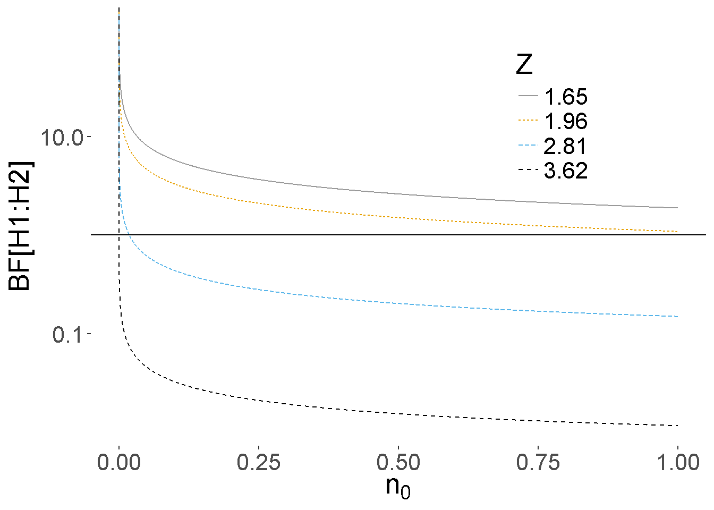
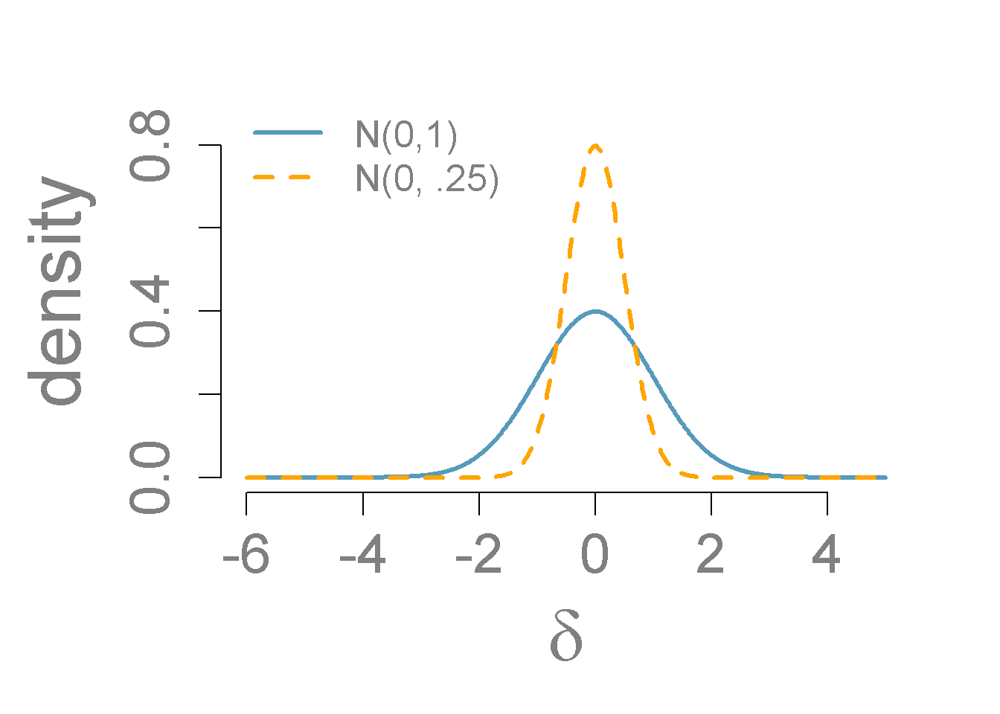

## Hypothesis Testing with Normal Populations

In Section \@ref(sec:bayes-factors), we described how the Bayes factors can be used for hypothesis testing. Now we will use the Bayes factors to test normal means, i.e. compare two groups of normally-distributed populations. We divide this mission into four cases: known variance, unknown variance, paired data, and independent groups.

### Bayes Factors for Testing a Normal Mean: variance known

Now we show how to obtain base factors for testing hypothesis about a normal mean, where **the variance is known**. To start, let's consider a random sample of observations from a normal population with mean $\mu$ and pre-specified variance $\sigma^2$. We consider testing whether the population mean $\mu$ is equal to $m_0$ or not. 

Therefore, we can formulate the data and hypotheses as below:

**Data**
$$Y_1, \cdots, Y_n \iid \No(\mu, \sigma^2)$$

**Hypotheses**

* $H_1: \mu = m_0$
* $H_2: \mu \neq m_0$

**Priors**

We also need to specify priors for $\mu$ under both hypotheses. Under $H_1$, we assume that $\mu$ is exactly $m_0$, so this occurs with probability 1 under $H_1$. Now under $H_2$, $\mu$ is unspecified, so we describe our prior uncertainty with the conjugate normal distribution centered at $m_0$ and with a variance $\sigma^2/\mathbf{n_0}$. This is centered at the hypothesized value $m_0$, and it seems that the mean is equally likely to be larger or smaller than $m_0$, so a dividing factor $n_0$ is given to the variance. The hyper parameter $n_0$ controls the precision of the prior as before.

In mathematical terms, the priors are:

* $H_1: \mu = m_0  \text{  with probability 1}$
* $H_2: \mu \sim \No(m_0, \sigma^2/\mathbf{n_0})$

**Bayes Factor**

Now the Bayes factor for comparing $H_1$ to $H_2$ is the ratio of the distribution, the data under the assumption that $\mu = m_0$ to the distribution of the data under $H_2$.

$$\begin{aligned}
\BF[H_1 : H_2] &= \frac{p(\data \mid \mu = m_0, \sigma^2 )}
 {\int p(\data \mid \mu, \sigma^2) p(\mu \mid m_0, \mathbf{n_0}, \sigma^2)\, d \mu} \\ 
\BF[H_1 : H_2] &=\left(\frac{n + \mathbf{n_0}}{\mathbf{n_0}} \right)^{1/2} \exp\left\{-\frac 1 2 \frac{n }{n + \mathbf{n_0}} Z^2 \right\} \\
 Z   &=  \frac{(\bar{Y} - m_0)}{\sigma/\sqrt{n}}
\end{aligned}$$

The term in the denominator requires integration to account for the uncertainty in $\mu$ under $H_2$. And it can be shown that the Bayes factor is a function of the observed sampled size, the prior sample size $n_0$ and a $Z$ score.

Let's explore how the hyperparameters in $n_0$ influences the Bayes factor in Equation \@ref(eq:BayesFactor). For illustration we will use the sample size of 100. Recall that for estimation, we interpreted $n_0$ as a prior sample size and considered the limiting case where $n_0$ goes to zero as a non-informative or reference prior. 

\begin{equation}
\BF[H_1 : H_2] = \left(\frac{n + \mathbf{n_0}}{\mathbf{n_0}}\right)^{1/2} \exp\left\{-\frac{1}{2} \frac{n }{n + \mathbf{n_0}} Z^2 \right\}
(\#eq:BayesFactor)
\end{equation}

Figure \@ref(fig:vague-prior) shows the Bayes factor for comparing $H_1$ to $H_2$ on the y-axis as $n_0$ changes on the x-axis. The different lines correspond to different values of the $Z$ score or how many standard errors $\bar{y}$ is from the hypothesized mean. As expected, larger values of the $Z$ score favor $H_2$.

(\#fig:vague-prior)Vague prior for mu: n=100

But as $n_0$ becomes smaller and approaches 0, the first term in
the Bayes factor goes to infinity, while the exponential term involving the
data goes to a constant and is ignored. In the limit as $n_0 \rightarrow 0$ under this noninformative prior, the Bayes factor paradoxically ends up favoring $H_1$ regardless of the value of $\bar{y}$.

The takeaway from this is that we cannot use improper priors with $n_0 = 0$, if we are going to test our hypothesis that $\mu = n_0$. Similarly, vague priors that use a small value of $n_0$ are not recommended due to the sensitivity of the results to the choice of an arbitrarily small value of $n_0$.

This problem arises with vague priors -- the Bayes factor favors the null model $H_1$ even when the data are far away from the value under the null -- are known as the Bartlett's paradox or the Jeffrey's-Lindleys paradox.

Now one way to try to understand the effect of prior is through the standard effect size 

$$\delta = \frac{\mu - m_0}{\sigma}.$$
The prior of the standard effect size is 

$$\delta \mid   H_2  \sim \No(0, \frac{1}{\mathbf{n_0}})$$

This allows us to think about a standardized effect independent of the units of the problem. One default choice is using the unit information prior, where the prior sample size $n_0$ is 1, leading to a standard normal for the standardized effect size. This is depicted with the blue normal density in Figure \@ref(fig:effect-size).

(\#fig:effect-size)Prior on standard effect size

UNFINISHED BELOW

### Bayes Factors for Testing a Normal Mean: unknown variance

### Testing Normal Means: paired data

### Testing Normal Means: independent groups

### Inference after Testing
