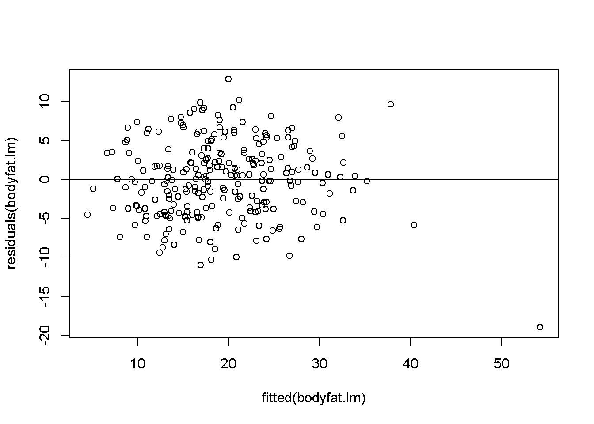
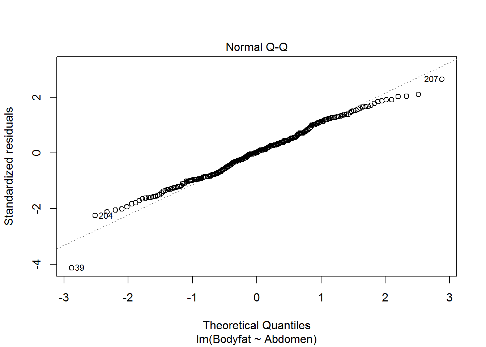

## Bayesian Simple Linear Regression

In this section, we turn to Bayesian inference in simple linear regression. We will use reference prior distribution which will provide a connection between the frequentist solution and Bayesian answers. This provides a baseline analysis for comparions with more informative prior distributions. To illustrate the ideas, we will use an example of predicting body fat. 

### Frequentist Ordinary Least Square Simple Linear Regression

Obtaining accurate measurements of body fat is expensive and not easy to be done. Instaed, predictive models which predict the percentage of body fat using readily available measurements such as abdominal circumference are easy to use and inexpensive. We will illustrate this using the `bodyfat` data from the library `BAS`. 

To start, we load the `BAS` library (you may download the package from CRAN) to access the dataframe. We print out a summary of the variables in this dataframe.


```r
library(BAS)
```

```
## Warning: package 'BAS' was built under R version 3.4.2
```

```r
data(bodyfat)
summary(bodyfat)
```

```
##     Density         Bodyfat           Age            Weight     
##  Min.   :0.995   Min.   : 0.00   Min.   :22.00   Min.   :118.5  
##  1st Qu.:1.041   1st Qu.:12.47   1st Qu.:35.75   1st Qu.:159.0  
##  Median :1.055   Median :19.20   Median :43.00   Median :176.5  
##  Mean   :1.056   Mean   :19.15   Mean   :44.88   Mean   :178.9  
##  3rd Qu.:1.070   3rd Qu.:25.30   3rd Qu.:54.00   3rd Qu.:197.0  
##  Max.   :1.109   Max.   :47.50   Max.   :81.00   Max.   :363.1  
##      Height           Neck           Chest           Abdomen      
##  Min.   :29.50   Min.   :31.10   Min.   : 79.30   Min.   : 69.40  
##  1st Qu.:68.25   1st Qu.:36.40   1st Qu.: 94.35   1st Qu.: 84.58  
##  Median :70.00   Median :38.00   Median : 99.65   Median : 90.95  
##  Mean   :70.15   Mean   :37.99   Mean   :100.82   Mean   : 92.56  
##  3rd Qu.:72.25   3rd Qu.:39.42   3rd Qu.:105.38   3rd Qu.: 99.33  
##  Max.   :77.75   Max.   :51.20   Max.   :136.20   Max.   :148.10  
##       Hip            Thigh            Knee           Ankle     
##  Min.   : 85.0   Min.   :47.20   Min.   :33.00   Min.   :19.1  
##  1st Qu.: 95.5   1st Qu.:56.00   1st Qu.:36.98   1st Qu.:22.0  
##  Median : 99.3   Median :59.00   Median :38.50   Median :22.8  
##  Mean   : 99.9   Mean   :59.41   Mean   :38.59   Mean   :23.1  
##  3rd Qu.:103.5   3rd Qu.:62.35   3rd Qu.:39.92   3rd Qu.:24.0  
##  Max.   :147.7   Max.   :87.30   Max.   :49.10   Max.   :33.9  
##      Biceps         Forearm          Wrist      
##  Min.   :24.80   Min.   :21.00   Min.   :15.80  
##  1st Qu.:30.20   1st Qu.:27.30   1st Qu.:17.60  
##  Median :32.05   Median :28.70   Median :18.30  
##  Mean   :32.27   Mean   :28.66   Mean   :18.23  
##  3rd Qu.:34.33   3rd Qu.:30.00   3rd Qu.:18.80  
##  Max.   :45.00   Max.   :34.90   Max.   :21.40
```

This dataframe includes 252 measurements on men of body fat and other measurements, such as waist circumference (`Abdomen`). We will use `Abdomen` to illustrate Bayesian simple linear regression. We regress the response variable `Bodyfat` on the predictor `Abdomen`, which gives us the model
$$ Y_i = \alpha + \beta X_i + \epsilon_i, $$
which the assumption that the errors $\epsilon_i$ are independent and identically distributed as normal random variables with mean zero and constant variance $\sigma^2$. 

The figure below shows the percentage body fat obtained from under water weighing and the abdominal circumference for 252 men. To predict body fat, the line overlayed on the scatter plot illustrates the best fitting ordinary least squares line obtained with the `lm` function in R.


```r
plot(Bodyfat ~ Abdomen, data = bodyfat, 
     xlab = "abdomen circumference (cm)", 
     col = "blue", pch = 16, main = "")

# Ordinary least square linear regression
bodyfat.lm = lm(Bodyfat ~ Abdomen, data = bodyfat)
summary(bodyfat.lm)
```

```
## 
## Call:
## lm(formula = Bodyfat ~ Abdomen, data = bodyfat)
## 
## Residuals:
##      Min       1Q   Median       3Q      Max 
## -19.0160  -3.7557   0.0554   3.4215  12.9007 
## 
## Coefficients:
##              Estimate Std. Error t value Pr(>|t|)    
## (Intercept) -39.28018    2.66034  -14.77   <2e-16 ***
## Abdomen       0.63130    0.02855   22.11   <2e-16 ***
## ---
## Signif. codes:  0 '***' 0.001 '**' 0.01 '*' 0.05 '.' 0.1 ' ' 1
## 
## Residual standard error: 4.877 on 250 degrees of freedom
## Multiple R-squared:  0.6617,	Adjusted R-squared:  0.6603 
## F-statistic: 488.9 on 1 and 250 DF,  p-value: < 2.2e-16
```

```r
beta = coef(bodyfat.lm)
abline(beta, lwd = 4, col = 1)
```



From the summary, we see that this model has an estimated slope, $\hat{\beta}$, of 0.63 and an estimated intercept, $\hat{\alpha}$, of about -39.28%. For every additional centimeter, we expect body fat to increase by 0.63%. The negative interceptive course does not make sense as a physical model, but neither does predicting a male with a waist of zero centimeters. Nevertheless, this linear regression may be an accurate approximation for prediction purposes for measurements that are in the observed range for this population. 

The residuals, which provide an estimate of the fitting error, are equal to $\hat{\epsilon}_i = Y_i - \hat{Y}_i$, the difference between the observed values $Y_i$ and the fited values $\hat{Y}_i = \hat{\alpha} + \hat{\beta}X_i$, where $X_i$ is the abdominal circumference for the $i$th male. $\hat{\epsilon}_i$ are used for diagnostics as well as estimating the constant variance in the assumption of the model $\sigma^2$ via the mean squared error (MSE):
$$ \hat{\sigma}^2 = \frac{1}{n-2}\sum \hat{\epsilon}_i^2. $$
Here the degrees of freedom $n-2$ are the number of observations adjusted for the number of parameters that we estimated in the regression. The MSE, $\hat{\sigma}^2$, may be obtained from the output as the square of the entry labeled "residual standard error".

Since residuals and fitted values are uncorrelated with the expected value of the residuals equal to zero if the model is correct, the scatterplot of residuals versus fitted values provides an additional visual check of the model adequacy.

```r
plot(residuals(bodyfat.lm) ~ fitted(bodyfat.lm))
abline(h = 0)
```


With the exception of the one observation for the individual with the largest waist measurement, the residual plot suggests that the linear regression is a reasonable approximation.

Furthermore, we can check the normal probability plot of the residuals for the assumption of normally distributed errors:

```r
plot(bodyfat.lm, which = 2)
```




### Bayesian Simple Linear Regression Using Reference Prior

Let us now turn to the Bayesian version and show how to obtain the posterior distributions of $\alpha$ and $\beta$ under the reference prior. 

The Bayesian model starts with the same model as the classical frequentist approach:
$$ Y_i = \alpha + \beta X_i + \epsilon_i $$
with the assumption that the errors, $\epsilon_i$, are independent and identically distributed as normal random variables with mean zero and constant variance $\sigma^2$. This assumption is exactly the same as the classical inference for testing and constructing confidence intervals for $\alpha$ and $\beta$. 

