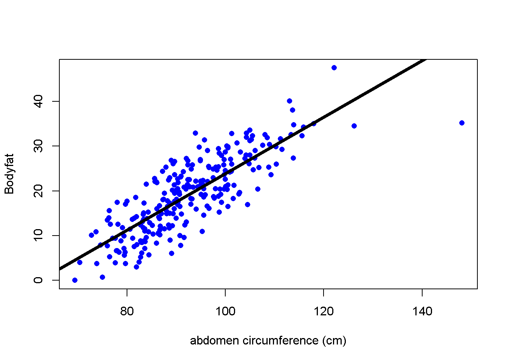
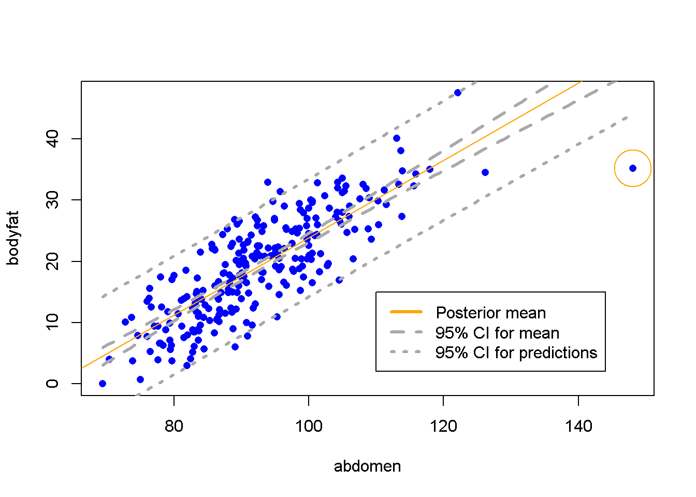

## Bayesian Simple Linear Regression

In this section, we turn to Bayesian inference in simple linear regression. We will use reference prior distribution which will provide a connection between the frequentist solution and Bayesian answers. This provides a baseline analysis for comparions with more informative prior distributions. To illustrate the ideas, we will use an example of predicting body fat. 

### Frequentist Ordinary Least Square Simple Linear Regression

Obtaining accurate measurements of body fat is expensive and not easy to be done. Instaed, predictive models which predict the percentage of body fat using readily available measurements such as abdominal circumference are easy to use and inexpensive. We will illustrate this using the `bodyfat` data from the library `BAS`. 

To start, we load the `BAS` library (you may download the package from CRAN) to access the dataframe. We print out a summary of the variables in this dataframe.


```r
# Suppress warning messages
library(BAS)
data(bodyfat)
summary(bodyfat)
```

```
##     Density         Bodyfat           Age            Weight     
##  Min.   :0.995   Min.   : 0.00   Min.   :22.00   Min.   :118.5  
##  1st Qu.:1.041   1st Qu.:12.47   1st Qu.:35.75   1st Qu.:159.0  
##  Median :1.055   Median :19.20   Median :43.00   Median :176.5  
##  Mean   :1.056   Mean   :19.15   Mean   :44.88   Mean   :178.9  
##  3rd Qu.:1.070   3rd Qu.:25.30   3rd Qu.:54.00   3rd Qu.:197.0  
##  Max.   :1.109   Max.   :47.50   Max.   :81.00   Max.   :363.1  
##      Height           Neck           Chest           Abdomen      
##  Min.   :29.50   Min.   :31.10   Min.   : 79.30   Min.   : 69.40  
##  1st Qu.:68.25   1st Qu.:36.40   1st Qu.: 94.35   1st Qu.: 84.58  
##  Median :70.00   Median :38.00   Median : 99.65   Median : 90.95  
##  Mean   :70.15   Mean   :37.99   Mean   :100.82   Mean   : 92.56  
##  3rd Qu.:72.25   3rd Qu.:39.42   3rd Qu.:105.38   3rd Qu.: 99.33  
##  Max.   :77.75   Max.   :51.20   Max.   :136.20   Max.   :148.10  
##       Hip            Thigh            Knee           Ankle     
##  Min.   : 85.0   Min.   :47.20   Min.   :33.00   Min.   :19.1  
##  1st Qu.: 95.5   1st Qu.:56.00   1st Qu.:36.98   1st Qu.:22.0  
##  Median : 99.3   Median :59.00   Median :38.50   Median :22.8  
##  Mean   : 99.9   Mean   :59.41   Mean   :38.59   Mean   :23.1  
##  3rd Qu.:103.5   3rd Qu.:62.35   3rd Qu.:39.92   3rd Qu.:24.0  
##  Max.   :147.7   Max.   :87.30   Max.   :49.10   Max.   :33.9  
##      Biceps         Forearm          Wrist      
##  Min.   :24.80   Min.   :21.00   Min.   :15.80  
##  1st Qu.:30.20   1st Qu.:27.30   1st Qu.:17.60  
##  Median :32.05   Median :28.70   Median :18.30  
##  Mean   :32.27   Mean   :28.66   Mean   :18.23  
##  3rd Qu.:34.33   3rd Qu.:30.00   3rd Qu.:18.80  
##  Max.   :45.00   Max.   :34.90   Max.   :21.40
```

This dataframe includes 252 measurements on men of body fat and other measurements, such as waist circumference (`Abdomen`). We will use `Abdomen` to illustrate Bayesian simple linear regression. We regress the response variable `Bodyfat` on the predictor `Abdomen`, which gives us the model
$$ y_i = \alpha + \beta x_i + \epsilon_i, $$
which the assumption that the errors $\epsilon_i$ are independent and identically distributed as normal random variables with mean zero and constant variance $\sigma^2$. 

The figure below shows the percentage body fat obtained from under water weighing and the abdominal circumference for 252 men. To predict body fat, the line overlayed on the scatter plot illustrates the best fitting ordinary least squares line obtained with the `lm` function in R.


```r
plot(Bodyfat ~ Abdomen, data = bodyfat, 
     xlab = "abdomen circumference (cm)", 
     col = "blue", pch = 16, main = "")

# Ordinary least square linear regression
bodyfat.lm = lm(Bodyfat ~ Abdomen, data = bodyfat)
summary(bodyfat.lm)
```

```
## 
## Call:
## lm(formula = Bodyfat ~ Abdomen, data = bodyfat)
## 
## Residuals:
##      Min       1Q   Median       3Q      Max 
## -19.0160  -3.7557   0.0554   3.4215  12.9007 
## 
## Coefficients:
##              Estimate Std. Error t value Pr(>|t|)    
## (Intercept) -39.28018    2.66034  -14.77   <2e-16 ***
## Abdomen       0.63130    0.02855   22.11   <2e-16 ***
## ---
## Signif. codes:  0 '***' 0.001 '**' 0.01 '*' 0.05 '.' 0.1 ' ' 1
## 
## Residual standard error: 4.877 on 250 degrees of freedom
## Multiple R-squared:  0.6617,	Adjusted R-squared:  0.6603 
## F-statistic: 488.9 on 1 and 250 DF,  p-value: < 2.2e-16
```

```r
beta = coef(bodyfat.lm)
abline(beta, lwd = 4, col = 1)
```



From the summary, we see that this model has an estimated slope, $\hat{\beta}$, of 0.63 and an estimated intercept, $\hat{\alpha}$, of about -39.28%. For every additional centimeter, we expect body fat to increase by 0.63%. The negative interceptive course does not make sense as a physical model, but neither does predicting a male with a waist of zero centimeters. Nevertheless, this linear regression may be an accurate approximation for prediction purposes for measurements that are in the observed range for this population. 

The residuals, which provide an estimate of the fitting error, are equal to $\hat{\epsilon}_i = Y_i - \hat{Y}_i$, the difference between the observed values $Y_i$ and the fited values $\hat{Y}_i = \hat{\alpha} + \hat{\beta}X_i$, where $X_i$ is the abdominal circumference for the $i$th male. $\hat{\epsilon}_i$ are used for diagnostics as well as estimating the constant variance in the assumption of the model $\sigma^2$ via the mean squared error (MSE):
$$ \hat{\sigma}^2 = \frac{1}{n-2}\sum_i^n (y_i-\hat{y}_i)^2 = \frac{1}{n-2}\sum_i^n \hat{\epsilon}_i^2. $$
Here the degrees of freedom $n-2$ are the number of observations adjusted for the number of parameters that we estimated in the regression. The MSE, $\hat{\sigma}^2$, may be obtained from the output as the square of the entry labeled "residual standard error".

Since residuals and fitted values are uncorrelated with the expected value of the residuals equal to zero if the model is correct, the scatterplot of residuals versus fitted values provides an additional visual check of the model adequacy.

```r
plot(residuals(bodyfat.lm) ~ fitted(bodyfat.lm))
abline(h = 0)
```


With the exception of the one observation for the individual with the largest waist measurement, the residual plot suggests that the linear regression is a reasonable approximation.

Furthermore, we can check the normal probability plot of the residuals for the assumption of normally distributed errors. We see that only observation 39 is exceptionally away from the normal quantile. 

```r
plot(bodyfat.lm, which = 2)
```


The confidence interval of $\alpha$ and $\beta$ can be constructed using the standard errors $\text{sd}_{\hat{\alpha}}$ and $\text{sd}_{\hat{\beta}}$ respectively. To proceed, we introduce notations of some "sums of squares"
$$
\begin{aligned}
\text{S}_{xx} = & \sum_i^n (x_i-\bar{x})^2\\
\text{S}_{yy} = & \sum_i^n (y_i-\bar{x})^2 \\
\text{S}_{xy} = & \sum_i^n (x_i-bar{x})(y_i-\bar{y}) \\
\text{SSE}    = & \sum_i^n (y_i-\hat{y}_i)^2 = \sum_i^n \hat{\epsilon}_i^2. 
\end{aligned}
$$

$\hat{\alpha}$ and $\hat{\beta}$ can be calculated using these "sums of squares"
$$ \hat{\beta} = \frac{\sum_i (x_i-\bar{x})(y_i-\bar{y})}{\sum_i (x_i-\bar{x})^2} = \frac{\text{S}_{xy}}{\text{S}_{xx}},\qquad \hat{\alpha} = \bar{y} - \hat{\beta}\bar{x} = \bar{y}-\frac{\text{S}_{xy}}{\text{S}_{xx}}\bar{x} $$

The last "sum of square" is the *sum of squars of errors*. Its sample mean is exactly the mean squared error (MSE) we introduced previously
$$
\hat{\sigma}^2 = \frac{\text{SSE}}{n-2} = \text{MSE}
$$

$\text{sd}_{\hat{\alpha}}$ and $\text{sd}_{\hat{\beta}}$ are given as
$$ 
\begin{aligned}
\text{sd}_{\hat{\alpha}} = &  \sqrt{\frac{\text{SSE}}{n-2}\left(\frac{1}{n}+\frac{\bar{x}^2}{\text{S}_{xx}}\right)} = \hat{\sigma}\sqrt{\frac{1}{n}+\frac{\bar{x}^2}{\text{S}_{xx}}}\\
\text{sd}_{\hat{\beta}} = & \sqrt{\frac{\text{SSE}}{n-2}\frac{1}{\text{S}_xx}} = \frac{\hat{\sigma}}{\sqrt{\text{S}_{xx}}}
\end{aligned}
$$

We may construct the confidence intervals of $\alpha$ and $\beta$ using the $t$-statistics
$$ 
t_\alpha^\ast = \frac{\alpha - \hat{\alpha}}{\text{sd}_{\hat{\alpha}}},\qquad t_\beta^\ast = \frac{\beta-\hat{\beta}}{\text{sd}_{\hat{\beta}}} 
$$

They both have degrees of freedom $n-2$.


### Bayesian Simple Linear Regression Using Reference Prior

Let us now turn to the Bayesian version and show how to obtain the posterior distributions of $\alpha$ and $\beta$ under the reference prior. 

The Bayesian model starts with the same model as the classical frequentist approach:
$$ y_i = \alpha + \beta x_i + \epsilon_i, $$
with the assumption that the errors, $\epsilon_i$, are independent and identically distributed as normal random variables with mean zero and constant variance $\sigma^2$. This assumption is exactly the same as the classical inference for testing and constructing confidence intervals for $\alpha$ and $\beta$. 

Our goal is to update the distributions of the unknown parameters $\alpha$, $\beta$, and $\sigma^2$, based on the data $x_1, y_1, \cdots, x_n, y_n$, where $n$ is the number of observations. 

Under the assumption that the errors $\epsilon_i$ are normally distributed with constant variance $\sigma^2$, we have for each response $y_i$, conditioning on the observed data $x_i$ and the parameters $\alpha,\ \beta,\ \sigma^2$, is normally distributed: 
$$ y_i~|~x_i, \alpha, \beta,\sigma^2 \sim \mathcal{N}(\alpha + \beta x_i, \sigma^2),\qquad i = 1,\cdots, n. $$
That is, the likelihood of $y_i$ given $x_i, \alpha, \beta$, and $\sigma^2$ is
$$ \pi(y_i~|~x_i, \alpha, \beta, \sigma^2) = \frac{1}{\sqrt{2\pi\sigma^2}}\exp\left(-\frac{(y_i-(\alpha+\beta  x_i))^2}{2\sigma^2}\right). $$

We will first consider the standard noninformative prior (reference prior). Using the reference prior, we will obtain familiar distributions as the posterior distributions of $\alpha$, $\beta$, and $\sigma^2$, which gives the analogue to the frequentist results. Here we assume 
$$ \pi(\alpha, \beta, \sigma^2)\propto \frac{1}{\sigma^2}. $$
Using the hierachical model framework, we may equivalently assume that the joint prior distribution of $\alpha$ and $\beta$ under $\sigma^2$ is the uniform prior, while the prior distribution of $\sigma^2$ is proportional to $\displaystyle \frac{1}{\sigma^2}$. That is
$$ \pi(\alpha, \beta~|~\sigma^2) \propto 1, \qquad \pi(\sigma^2) \propto \frac{1}{\sigma^2}, $$
Combining the two using conditional probability, we will get the same joint prior distribution. 

Then we apply the Bayes' rule to derive the posterior joint distribution after observing $y_1,\cdots, y_n$: 
$$
\begin{aligned}
\pi^*(\alpha, \beta, \sigma^2~|~y_1,\cdots,y_n) \propto & \left[\prod_i^n\pi(y_i~|~x_i,\alpha,\beta,\sigma^2)\right]\pi(\alpha, \beta,\sigma^2) \\
\propto & \left[\left(\frac{1}{(\sigma^2)^{1/2}}\exp\left(-\frac{(y_1-(\alpha+\beta x_1 ))^2}{2\sigma^2}\right)\right)\times\cdots \right.\\
& \left. \times \left(\frac{1}{(\sigma^2)^{1/2}}\exp\left(-\frac{(y_n-(\alpha +\beta x_n))^2}{2\sigma^2}\right)\right)\right]\times\left(\frac{1}{\sigma^2}\right)\\
\propto & \frac{1}{(\sigma^2)^{(n+2)/2}}\exp\left(-\frac{\sum_i\left(y_i-\alpha-\beta  x_i\right)^2}{2\sigma^2}\right)
\end{aligned}
$$

For example, to obtain the marginal distribution of $\beta$, the slope of the linear regression model, we integrate $\alpha$ and $\sigma^2$ out:
$$ \pi^*(\beta~|~y_1,\cdots,y_n) = \int_0^\infty \left(\int_{-\infty}^\infty \pi^*(\alpha, \beta, \sigma^2~|~y_1,\cdots, y_n)\, d\alpha\right)\, d\sigma^2. $$

It can be shown that the marginal posterior distribution of $\beta$ is the Student's $t$-distribution
$$ \beta~|~y_1,\cdots,y_n \sim t_{n-2}\left(\hat{\beta}, \frac{\hat{\sigma}^2}{\text{S}_{xx}}\right) = t_{n-2}\left(\hat{\beta}, (\text{sd}_{\hat{\beta}})^2\right) $$
with degrees of freedom $n-2$, center at $\hat{\beta}$, the coefficient we obtain from the frequentist OLS model, and scale parameter $\displaystyle \frac{\hat{\sigma}^2}{\text{S}_{xx}}=\left(\text{sd}_{\hat{\beta}}\right)^2$, which is the square of the standard error of $\hat{\beta}$ under the frequentist OLS model.

Similarly, we can integrate out $\beta$ and $\sigma^2$ from the joint posterior distribution to get the marginal posterior distribution of $\alpha$, $\pi^*(\alpha~|~y_1,\cdots, y_n)$. It turns out that $\pi^*(\alpha~|~y_1,\cdots,y_n)$ is again the Student's $t$-distribution with degrees of freedom $n-2$, center at $\hat{\alpha}$, the $y$-intercept from the frequentist OLS model, and scale parameter $\displaystyle \hat{\sigma}^2\left(\frac{1}{n}+\frac{\bar{x}^2}{\text{S}_{xx}}\right) = \left(\text{sd}_{\hat{\alpha}}\right)^2$, which is the square of the standard error of $\hat{\alpha}$ under the frequentist OLS model.


Moreover, we can show that the marginal posterior distribution of $\sigma^2$ is the inverse Gamma distribution
$$ \sigma^2~|~y_1,\cdots,y_n \sim \text{IG}\left(\frac{n-2}{2}, \frac{\text{SSE}}{2}\right). $$

We provide the detailed deviations in section ??? (how to do reference in R Markdown?)

**Credible Intervals for the Slope $\beta$ and the Intercept $\alpha$ **

The Bayesian posterior distribution results of $\alpha$ and $\beta$ show that under the reference prior, the posterior credible intervals are in fact numerically equivalent to the confidence intervals from the classical frequentist analysis, providing a baseline for other Bayesian analyses with more informative prior distributions or perhaps other "objective" prior distributions, such as a Student's $t$ prior with 1 degree of freedome which is known as the Cauchy distribution.

We can use the `lm` function to obtain the OLS estimates and construct the credible intervals of $\alpha$ and $\beta$


```r
output = summary(bodyfat.lm)$coef[, 1:2]
output
```

```
##                Estimate Std. Error
## (Intercept) -39.2801847 2.66033696
## Abdomen       0.6313044 0.02855067
```


The columns labeled `Estimate` and `Std. Error` are equivalent to the centers (or posterior means) and scale parameters (or standard deviations) in the two $t$-distributions respetively. The credible intervals of $\alpha$ and $\beta$ are the same as the frequentist ocnfidence intervals, but we now can interpret them from a Bayesian perspective. 

The `confint` function provides 95% confidence intervals, which under the reference prior are equivalent to the 95% credible intervals. The code below extracts them and relabels the output as the Bayesian results.

```r
out = cbind(output, confint(bodyfat.lm))
colnames(out) = c("posterior mean", "posterior std", "2.5", "97.5")
round(out, 2)
```

```
##             posterior mean posterior std    2.5   97.5
## (Intercept)         -39.28          2.66 -44.52 -34.04
## Abdomen               0.63          0.03   0.58   0.69
```

These intervals coincide with the confidence intervals from the frequentist approach. The primary difference is the interpretation. For example, based on the data, we believe that there is 95% chance that body fat will increase by 5.8% up to 6.9% for every additional 10 centimeter increase in the waist circumference.


**Credible Intervals for the Mean $\mu_Y$ and the Prediction $y_{n+1}$**

Under the reference prior, the mean of $Y$, $\mu_Y$, at the point $x_i$ is given by $\alpha + \beta x_i$, with a posterior distributuion 
$$ 
\alpha + \beta x_i ~|~ \text{data} \sim t_{n-2}(\hat{\alpha} + \hat{\beta} x_i, \text{S}_{Y|X_i}^2), 
$$
where
$$
\text{S}_{Y|X_i}^2 = \hat{\sigma}^2\left(\frac{1}{n}+\frac{(x_i-\bar{x})^2}{\text{S}_{xx}}\right)
$$

A new prediction $y_{n+1}$ at a point $x_{n+1}$ follows the Student's $t$-distribution
$$ 
y_{n+1}~|~\text{data}, x_{n+1}\ \sim t_{n-2}\left(\hat{\alpha}+\hat{\beta} x_{n+1},\text{S}_{Y|X_{n+1}}^2\right), 
$$

where
$$ 
\text{S}_{Y|X_{n+1}}^2 =\hat{\sigma}^2+\hat{\sigma}^2\left(\frac{1}{n}+\frac{(x_{n+1}-\bar{x})^2}{\text{S}_{xx}}\right) = \hat{\sigma}^2\left(1+\frac{1}{n}+\frac{(x_{n+1}-\bar{x})^2}{\text{S}_{xx}}\right).
$$

The variance for predicting a new observation $y_{n+1}$ has an extra $\hat{\sigma}^2$ which comes from the uncertainty of a new observation about the mean $\mu_Y$ estimated by the regressio line. 

We can extract these intervals using the `predict` function

```r
x = bodyfat$Abdomen
y = bodyfat$Bodyfat
xnew <- seq(min(x), max(x), length.out = 100)
ynew <- data.frame(predict(bodyfat.lm, newdata = data.frame(Abdomen = xnew),
                           interval = "confidence", level = 0.95))

# plot the data with the credible intervals of the mean
plot(x, y, xlab = "abdomen", ylab = "bodyfat", col = "blue", pch = 16)
lines(ynew$lwr ~ xnew, lty = 2, lwd = 3, col = "darkgrey")
lines(ynew$upr ~ xnew, lty = 2, lwd = 3, col = "darkgrey")
abline(bodyfat.lm, col = "orange")

# plot the credible intervals of the prediction
ypred <- data.frame(predict(bodyfat.lm, newdata = data.frame(Abdomen = xnew),
                            interval = "prediction", level = 0.95))
lines(ypred$lwr ~ xnew, lty = 3, lwd = 3, col = "darkgrey")
lines(ypred$upr ~ xnew, lty = 3, lwd = 3, col = "darkgrey")

# identify the potential outlier: observation 39
points(bodyfat[39, "Abdomen"], bodyfat[39, "Bodyfat"], col = "orange", cex = 5)
legend(110, 15, legend = c("Posterior mean", "95% CI for mean", "95% CI for predictions"),
       col = c("orange", rep("darkgrey", 2)), lwd = 3, lty = c(1, 2, 3))
```



Note in the ablve the legend "CI" can mean either confidence interval or credible interval. The difference comes down to the interpretation. For example, the prediction at the same abdominal circumference as in Case 39 is

```r
pred.39 = predict(bodyfat.lm, newdata = bodyfat[39, ], interval = "prediction", level = 0.95)
out <- cbind(bodyfat[39,]$Abdomen, pred.39)
colnames(out) <- c("abdomen", "prediction", "lower", "upper")
out
```

```
##    abdomen prediction   lower    upper
## 39   148.1   54.21599 44.0967 64.33528
```

Based on the data, a Bayesian would expect that a man with waist circumference of 148.1 centermeters should have bodyfat of 54.216 with 95% chance thta it is between 44.097 and 64.335 percent.

While we expect the majority of the data will be within the prediction intervals (the short dashed grey lines), Case 39 seems to be well below the interval. We next use Bayesian methods to calculate the probability that this case is abnormal or an outlier by falling more than $k$ standard deviations from either side of the mean.

### Ourliers

The plot and predictive intervals suggest that predictions for Case 39 are not well captured by the model. There is always the possibility that this case does not meet the assumptions of the simple linear regression model (wrong mean or variance) or could be in error. Model diagnostics such as plots of residuals versus fitted values are useful in identifying potential outliers. Now with the interpretation of Bayesian paradigm, we can go further to calculate the probability to demonstrate whether a case falls too far from the mean. 

The article by Chaloner & Brant (1988) (???reference????) suggested an approach for defining outliers and then calculating the probability that a case or multiple cases were outliers. The assumed model for our simple linear regression is $y_i=\alpha + \beta x_i+\epsilon_i$, with $\epsilon_i$ having independent, identical distributions that are normal with mean zero and constant variance $\sigma^2$, i.e., $\epsilon_i \sim \mathcal{N}(0, \sigma^2)$. Chaloner & Brant consider outliers to be points where the error or the model discrepancy $\epsilon_i$ is greater than $k$ standard deviation for some large $k$, and then proceed to calculate the posterior probability that a case is an outlier to be
$$ \mathbb{P}(|\epsilon_i| > k\sigma ~|~\text{data}) $$

Since $\epsilon_i = y_i - \alpha-\beta x_i$, this is equivalent to calculating
$$ \mathbb{P}(|y_i-\alpha-\beta x_i| > k\sigma~|~\text{data}).$$

The code for calculating the probability of outliers involves integration. We have implemented this in the function `Bayes.outlier.prob` that can be sourced from the file `bayes-outliers.R`. Applying this to the `bodyfat` data for Case 39, we get

```r
#source("bayes-outliers.R")
#library(mvtnorm)
#outliers = Bayes.outlier.prob(bodyfat.lm)

# The default is to consider k=3
#prob.39 = outliers$prob.outlier[39]
#prob.39
```

We see that this case has an extremely high probability (0.9917) of being more an outlier, that is, the error is greater than $k=3$ standard deviations, based on the fitted model and data.

With $k=3$, however, there may be a high probability a priori of at least one outlier in a large sample. We can compute this using


```r
n = nrow(bodyfat)
# probability of no outliers if outliers are error greater than 3 standard deviation
prob = (1 - (2 * pnorm(-3))) ^ n
prob
```

```
## [1] 0.5059747
```

```r
# probability of at least one outlier
prob.least1 = 1 - (1 - (2 * pnorm(-3))) ^ n
prob.least1
```

```
## [1] 0.4940253
```

With $n=252$, the probability of at least one outlier is much larger than say the marginal probability that one point is an outlier of 0.05. So we would expect that there will be at least one point where the error is more than 3 standard deviations from zero almost 50% of the time. Rather than fixing $k$, we can fix the prior probability of no outliers to be say 0.95, and solve for the value of $k$.


```r
k = qnorm(0.5 + 0.5 * 0.95 ^ (1 / n))
k
```

```
## [1] 3.714602
```

This leads to a larger value of $k$ after adjusting $k$ so that there is at least one outlier. We examine Case 39 again under this $k$


```r
#outliers.no = Bayes.outlier.prob(bodyfat.lm, k = k)
#prob.no.39 = outliers.no$prob.outlier[39]
#prob.no.39
```

The posterior probability of Case 39 being an outlier is 0.68475. While this is not strikingly large, it is much larger than the marginal prior probability of

```r
2 * pnorm(-k)
```

```
## [1] 0.0002035241
```


**Summary**

There is a substantial probability that Case 39 is an outlier. If you do view it as an outlier, what are your options? One option is to investigate the case and determine if the data are input incorrectly, and fix it. Another option is when you cannot confirm there is a data entry error, you may delete the observation from the analysis and refit the model without the case. If you do take this option, be sure to describe what you did so that your research is reproducible. You may want to apply diagnostics and calculate the probability of a case being an outlier using this reduced data. As a word of caution, if you discover that there are a large number of points that appear to be outliers, take a second look at your model assumptions, since the problem may be with the model rather than the data! A third option we will talk about later, is to combine inference under the model that retains this case as part of the population, and the model that treats it as coming from another population. This approach incorporates our uncertainty about whether the case is an outlier given the data.

The source code is based on using a reference prior for the linear model and extends to multiple regression.


### Informative Priors

Except from the noninformative reference prior, we may also consider using a more general semi-conjugate prior distribution of $\alpha$, $\beta$, and $\sigma^2$ when there is information available about the parameters. 

Since the data $y_1,\cdots,y_n$ are normally distributed, from Chapter 3 we see that a Normal-Gamma distribution will form a conjugacy in this situation. We then set up the prior distributions through a hierarchical model. We first assume that, given $\sigma^2$, $\alpha$ and $\beta$ together follow the bivariate normal prior distribution, from which their marginal distributions are both normal, 
$$ 
\begin{aligned}
\alpha~|~\sigma^2 \sim & \mathcal{N}(a_0, \sigma^2\text{S}_\alpha) \\
\beta ~|~ \sigma^2 \sim & \mathcal{N}(b_0, \sigma^2\text{S}_\beta),
\end{aligned}
$$
with covariance
$$ \text{Cov}(\alpha, \beta ~|~\sigma^2) =\sigma^2 \text{S}_{\alpha\beta}. $$

This is equivalent to setting the coefficient vector $(\alpha, \beta)$ to have a biraviate normal distribution with convariance matrix $\Sigma_0$ given by $\text{S}_\alpha$, $\text{S}_{\beta}$, and $\text{S}_{\alpha\beta}$
$$ (\alpha, \beta) ~|~\sigma^2 \sim \text{BiraviateNormal}((a_0, b_0), \sigma^2\Sigma_0). $$

Then for $\sigma^2$, we will use a Inverse Gamma distribution 
$$ \sigma^2 \sim \text{IG}\left(\frac{\nu_0}{2}, \frac{\nu_0\sigma_0}{2}\right). $$
Now the join prior distribution of $\alpha, \beta$, and $\sigma^2$ form a distribution that is analogous to the Normal-Gamma distribution. Prior information about $\alpha$, $\beta$, and $\sigma^2$ are encoded in the hyperparameters $a_0$, $b_0$, $\text{S}_\alpha$, $\text{S}_\beta$, $\text{S}_{\alpha\beta}$, $\nu_0$, and $\sigma_0$. 

The marginal posterior distribution of the coefficient vector $(\alpha, \beta)$ will be biraviate normal, and the marginal posterior distribution of $\sigma^2$ is again a Inverse Gamma distribution
$$ \sigma^2~|~y_1,\cdots,y_n \sim \text{IG}\left(\frac{\nu_0+n}{2}, \frac{\nu_0\sigma_0^2+\text{SSE}}{2}\right). $$

One can see that the reference prior is the limiting case of this conjugate prior we impose. We usually use Gibbs sampling to approximate the joint posterior distribution instead of using the result directly, especially later in multiple linear regression when we have more coefficients. We omit the deviations of the posterior distributions due to the heavy use of advanced linear algebra. One can refer to (Hopf's book, how to reference????) for more details.

Based on any prior information we have for the model, we can also impose other priors and assumptions on $\alpha$, $\beta$, and $\sigma^2$ to get different Bayesian results. Most of these priors will not form any conjugacy and will require us to use simulation methods such as MCMC for approximations.


### Deviations of Marginal Posterior Distributions of $\alpha$, $\beta$, and $\sigma^2$

In this section, we will use the notations we introduced earlier such as $\text{SSE}$, the sum of squares of errors, $\hat{\sigma}^2$, the mean squared error, $\text{S}_{xx}$, $\text{sd}_{\hat{\alpha}}$, $\text{sd}_{\hat{\beta}}$ and so on to simplify our calculations.

We will also use the following quantities derived from the formula of $\bar{x}$, $\bar{y}$, $\hat{\alpha}$, and $\hat{\beta}$
$$
\begin{aligned}
& \sum_i^n (x_i-\bar{x}) = 0 \\
& \sum_i^n (y_i-\bar{y}) = 0 \\
& \sum_i^n (y_i - \hat{y}_i) = \sum_i^n (y_i - (\hat{\alpha} + \hat{\beta} x_i)) = 0\\
& \sum_i^n (x_i-\bar{x})(y_i - \hat{y}_i) = \sum_i^n (x_i-\bar{x})(y_i-\bar{y}-\hat{\beta}(x_i-\bar{x})) = \sum_i^n (x_i-\bar{x})(y_i-\bar{y})-\hat{\beta}\sum_i^n(x_i-\bar{x})^2 = 0\\
& \sum_i^n x_i^2 = \sum_i^(x_i-\bar{x})^2 + n\bar{x}^2 = \text{S}_{xx}+n\bar{x}^2
\end{aligned}
$$

We first further simplify the numerator inside the exponential function in the formula of $\pi^*(\alpha, \beta, \sigma^2~|~y_1,\cdots,y_n)$:
$$ 
\begin{aligned}
\sum_i^n \left(y_i - \alpha - \beta x_i\right)^2 = & \sum_i^n \left(y_i - \hat{\alpha} - \hat{\beta}x_i - (\alpha - \hat{\alpha}) - (\beta - \hat{\beta})x_i\right)^2 \\
= & \sum_i^n \left(y_i - \hat{\alpha} - \hat{\beta}x_i\right)^2 + \sum_i^n (\alpha - \hat{\alpha})^2 + \sum_i^n (\beta-\hat{\beta})^2(x_i)^2 \\
  & - 2\sum_i^n (\alpha - \hat{\alpha})(y_i-\hat{\alpha}-\hat{\beta}x_i)\\
  & - 2\sum_i^n (\beta-\hat{\beta})(x_i)(y_i-\hat{\alpha}-\hat{\beta}x_i)\\
  & + 2\sum_i^n(\alpha - \hat{\alpha})(\beta-\hat{\beta})(x_i)\\
= & \text{SSE} + n(\alpha-\hat{\alpha})^2 + (\beta-\hat{\beta})^2\sum_i^n x_i^2 - 2(\alpha-\hat{\alpha})\sum_i^n (y_i-\hat{y}_i) \\
  & -2(\beta-\hat{\beta})\sum_i^n x_i(y_i-\hat{y}_i)+2(\alpha-\hat{\alpha})(\beta-\hat{\beta})(n\bar{x})
\end{aligned}
$$

It is clear that
$$ -2(\alpha-\hat{\alpha})\sum_i^n(y_i-\hat{y}_i) = 0 $$

And
$$
\begin{aligned}
-2(\beta-\hat{\beta})\sum_i^n x_i(y_i-\hat{y}_i) = & -2(\beta-\hat{\beta})\sum_i(x_i-\bar{x})(y_i-\hat{y}_i) - 2(\beta-\hat{\beta})\sum_i^n \bar{x}(y_i-\hat{y}_i) \\
= & -2(\beta-\hat{\beta})\times 0 - 2(\beta-\hat{\beta})\bar{x}\sum_i^n(y_i-\hat{y}_i) = 0
\end{aligned}
$$

Finally, we use the quantity that $\displaystyle \sum_i^n x_i^2 = \sum_i^n(x_i-\bar{x})^2+ n\bar{x}^2$ to combine the terms $n(\alpha-\hat{\alpha})^2$, $2\displaystyle (\alpha-\hat{\alpha})(\beta-\hat{\beta})\sum_i^n x_i$, and $\displaystyle (\beta-\hat{\beta})^2\sum_i^n x_i^2$ together.

$$
\begin{aligned}
\sum_i^n (y_i-\alpha-\beta x_i)^2 = & \text{SSE} + n(\alpha-\hat{\alpha})^2 +(\beta-\hat{\beta})^2\sum_i^n (x_i-\bar{x})^2 + (\beta-\hat{\beta})^2 (n\bar{x}^2) \\
& +2(\alpha-\hat{\alpha})(\beta-\hat{\beta})(n\bar{x})\\
= & \text{SSE} + (\beta-\hat{\beta})^2\text{S}_{xx} + n\left[(\alpha-\hat{\alpha}) +(\beta-\hat{\beta})\bar{x}\right]^2
\end{aligned}
$$


Therefore, the posterior joint distribution of $\alpha, \beta, \sigma^2$ is
$$ 
\begin{aligned}
\pi^*(\alpha^*, \beta,\sigma^2 ~|~y_1,\cdots, y_n) \propto & \frac{1}{(\sigma^2)^{(n+2)/2}}\exp\left(-\frac{\sum_i(y_i - \alpha - \beta x_i)^2}{2\sigma^2}\right) \\
= & \frac{1}{(\sigma^2)^{(n+2)/2}}\exp\left(-\frac{\text{SSE} + n(\alpha-\hat{\alpha}+(\beta-\hat{\beta})\bar{x})^2 + (\beta - \hat{\beta})^2\sum_i (x_i-\bar{x})^2}{2\sigma^2}\right)
\end{aligned}
$$

**Marginal Posterior Distribution of $\beta$**

To get the marginal posterior distribution of $\beta$, we need to integrate out $\alpha$ and $\sigma^2$:

$$
\begin{aligned}
\pi^*(\beta ~|~y_1,\cdots,y_n) = & \int_0^\infty \int_{-\infty}^\infty \pi^*(\alpha, \beta, \sigma^2~|~y_1,\cdots, y_n)\, d\alpha\, d\sigma^2 \\
= & \int_0^\infty \left(\int_{-\infty}^\infty \frac{1}{(\sigma^2)^{(n+2)/2}}\exp\left(-\frac{\text{SSE} + n(\alpha-\hat{\alpha}+(\beta-\hat{\beta})\bar{x})^2+(\beta-\hat{\beta})\sum_i(x_i-\bar{x})^2}{2\sigma^2}\right)\, d\alpha\right)\, d\sigma^2
\end{aligned}
$$

The integral inside is the joint posterior distribution of $\beta$ and $\sigma^2$
$$
\begin{aligned}
& \pi^*(\beta, \sigma^2~|~y_1,\cdots,y_n) \\
= & \int_{-\infty}^\infty \frac{1}{(\sigma^2)^{(n+2)/2}}\exp\left(-\frac{\text{SSE}+n(\alpha-\hat{\alpha}+(\beta-\hat{\beta})\bar{x})^2+(\beta-\hat{\beta})^2\sum_i(x_i-\bar{x})^2}{2\sigma^2}\right)\, d\alpha\\
= & \int_{-\infty}^\infty \frac{1}{(\sigma^2)^{(n+2)/2}}\exp\left(-\frac{\text{SSE}+(\beta-\hat{\beta})^2\sum_i(x_i-\bar{x})^2}{2\sigma^2}\right) \exp\left(-\frac{n(\alpha-\hat{\alpha}+(\beta-\hat{\beta})\bar{x})^2}{2\sigma^2}\right)\, d\alpha \\
= & \frac{1}{(\sigma^2)^{(n+2)/2}}\exp\left(-\frac{\text{SSE}+(\beta-\hat{\beta})^2\sum_i(x_i-\bar{x})^2}{2\sigma^2}\right) \int_{-\infty}^\infty \exp\left(-\frac{n(\alpha-\hat{\alpha}+(\beta-\hat{\beta})\bar{x})^2}{2\sigma^2}\right)\, d\alpha
\end{aligned}
$$


Here, 
$$ \exp\left(-\frac{n(\alpha-\hat{\alpha}+(\beta - \hat{\beta})\bar{x})^2}{2\sigma^2}\right) $$
can be viewed as part of a normal distribution of $\alpha$, with mean $\hat{\alpha}-(\beta-\hat{\beta})\bar{x}$, and variance $\sigma^2/n$. Therefore, the integral from the last line above is proportional to $\sqrt{\sigma^2/n}$. We get

$$
\begin{aligned}
\pi^*(\beta, \sigma^2~|~y_1,\cdots,y_n) 
\propto & \frac{1}{(\sigma^2)^{(n+2)/2}}\exp\left(-\frac{\text{SSE}+(\beta-\hat{\beta})^2\sum_i(x_i-\bar{x})^2}{2\sigma^2}\right) \times \sqrt{\sigma^2}\\
= & \frac{1}{(\sigma^2)^{(n+1)/2}}\exp\left(-\frac{\text{SSE}+(\beta-\hat{\beta})^2\sum_i (x_i-\bar{x})^2}{2\sigma^2}\right)
\end{aligned}
$$

We then integrate $\sigma^2$ out to get the marginal distribution of $\beta$. Here we first  perform change of variable and set $\sigma^2 = \frac{1}{\phi}$. Then the integral becomes
$$
\begin{aligned}
\pi^*(\beta~|~y_1,\cdots, y_n) \propto & \int_0^\infty \frac{1}{(\sigma^2)^{(n+1)/2}}\exp\left(-\frac{\text{SSE} + (\beta-\hat{\beta})^2\sum_i(x_i-\bar{x})^2}{2\sigma^2}\right)\, d\sigma^2 \\
\propto & \int_0^\infty \phi^{\frac{n-3}{2}}\exp\left(-\frac{\text{SSE}+(\beta-\hat{\beta})^2\sum_i(x_i-\bar{x})^2}{2}\phi\right)\, d\phi\\
\propto & \left(\frac{\text{SSE}+(\beta-\hat{\beta})^2\sum_i(x_i-\bar{x})^2}{2}\right)^{-\frac{(n-2)+1}{2}}\int_0^\infty s^{\frac{n-3}{2}}e^{-s}\, ds
\end{aligned}
$$

Here we use another change of variable by setting $\displaystyle s=  \frac{\text{SSE}+(\beta-\hat{\beta})^2\sum_i(x_i-\bar{x})^2}{2}\phi$, and the fact that $\displaystyle \int_0^\infty s^{(n-3)/2}e^{-s}\, ds$ gives us the Gamma function, which is a constant.

We can rewrite the last line from above to obtain the marginal posterior distribution of $\beta$ to be the Student's $t$-distribution with degrees of freedom $n-2$, center $\hat{\beta}$, and scale parameter $\displaystyle \frac{\hat{\sigma}^2}{\sum_i(x_i-\bar{x})^2}$

$$ \pi^*(\beta~|~y_1,\cdots,y_n) \propto
 \left[1+\frac{1}{n-2}\frac{(\beta - \hat{\beta})^2}{\frac{\text{SSE}}{n-2}/(\sum_i (x_i-\bar{x})^2)}\right]^{-\frac{(n-2)+1}{2}} = \left[1 + \frac{1}{n-2}\frac{(\beta - \hat{\beta})^2}{\hat{\sigma}^2/(\sum_i (x_i-\bar{x})^2)}\right]^{-\frac{(n-2)+1}{2}},
$$

where $\displaystyle \frac{\hat{\sigma}^2}{\sum_i (x_i-\bar{x})^2}$ is exactly the square of the standard error of $\hat{\beta}$ from the frequentist OLS model. 

To summarize, under the reference prior, the marginal posterior distribution of the slope of the Bayesian simple linear regression follows the Student's $t$-distribution
$$ 
\beta ~|~y_1,\cdots, y_n \sim t_{n-2}\left(\hat{\beta}, \left(\text{sd}_{\hat{\beta}}\right)^2\right) 
$$

**Marginal Posterior Distribution of $\alpha$**

A similar approach will lead us to the marginal distribution of $\alpha$. We again start from the joint posterior distribution
$$ \pi^*(\alpha, \beta, \sigma^2~|~y_1,\cdots,y_n) \propto \frac{1}{(\sigma^2)^{(n+2)/2}}\exp\left(-\frac{\text{SSE} + n(\alpha-\hat{\alpha}-(\beta-\hat{\beta})\bar{x})^2 + (\beta - \hat{\beta})^2\sum_i (x_i-\bar{x})^2}{2\sigma^2}\right) $$

This time we integrate $\beta$ and $\sigma^2$ out to get the marginal posterior distribution of $\alpha$. We first compute the integral
$$
\begin{aligned}
\pi^*(\alpha, \sigma^2~|~y_1,\cdots, y_n) = & \int_{-\infty}^\infty \pi^*(\alpha, \beta, \sigma^2~|~y_1,\cdots, y_n)\, d\beta\\
= & \int_{-\infty}^\infty \frac{1}{(\sigma^2)^{(n+2)/2}}\exp\left(-\frac{\text{SSE} + n(\alpha-\hat{\alpha}+(\beta-\hat{\beta})\bar{x})^2 + (\beta - \hat{\beta})^2\sum_i (x_i-\bar{x})^2}{2\sigma^2}\right)\, d\beta 
\end{aligned}
$$

Here we group the terms with $\beta-\hat{\beta}$ together, then complete the square so that we can treat is as part of a normal distribution function to simplify the integral
$$
\begin{aligned}
& n(\alpha-\hat{\alpha}+(\beta-\hat{\beta})\bar{x})^2+(\beta-\hat{\beta})^2\sum_i(x_i-\bar{x})^2 \\
= & (\beta-\hat{\beta})^2\left(\sum_i (x_i-\bar{x})^2 + n\bar{x}^2\right) + 2n\bar{x}(\alpha-\hat{\alpha})(\beta-\hat{\beta}) + n(\alpha-\hat{\alpha})^2 \\
= & \left(\sum_i (x_i-\bar{x})^2 + n\bar{x}^2\right)\left[(\beta-\hat{\beta})+\frac{n\bar{x}(\alpha-\hat{\alpha})}{\sum_i(x_i-\bar{x})^2+n\bar{x}^2}\right]^2+ n(\alpha-\hat{\alpha})^2\left[\frac{\sum_i(x_i-\bar{x})^2}{\sum_i (x_i-\bar{x})^2+n\bar{x}^2}\right]\\
= & \left(\sum_i (x_i-\bar{x})^2 + n\bar{x}^2\right)\left[(\beta-\hat{\beta})+\frac{n\bar{x}(\alpha-\hat{\alpha})}{\sum_i(x_i-\bar{x})^2+n\bar{x}^2}\right]^2+\frac{(\alpha-\hat{\alpha})^2}{\frac{1}{n}+\frac{\bar{x}^2}{\sum_i (x_i-\bar{x})^2}}
\end{aligned}
$$

When integrating, we can then view 
$$ \exp\left(-\frac{\sum_i (x_i-\bar{x})^2+n\bar{x}^2}{2\sigma^2}\left(\beta-\hat{\beta}+\frac{n\bar{x}(\alpha-\hat{\alpha})}{\sum_i (x_i-\bar{x})^2+n\bar{x}^2}\right)^2\right) $$
as part of a normal distribution function, and get
$$
\begin{aligned}
& \pi^*(\alpha, \sigma^2~|~y_1,\cdots,y_n) \\
\propto & \frac{1}{(\sigma^2)^{(n+2)/2}}\exp\left(-\frac{\text{SSE}+(\alpha-\hat{\alpha})^2/(\frac{1}{n}+\frac{\bar{x}^2}{\sum_i (x_i-\bar{x})^2})}{2\sigma^2}\right)\\
& \times\int_{-\infty}^\infty \exp\left(-\frac{\sum_i (x_i-\bar{x})^2+n\bar{x}^2}{2\sigma^2}\left(\beta-\hat{\beta}+\frac{n\bar{x}(\alpha-\hat{\alpha})}{\sum_i (x_i-\bar{x})^2+n\bar{x}^2}\right)^2\right)\, d\beta \\
\propto & \frac{1}{(\sigma^2)^{(n+1)/2}}\exp\left(-\frac{\text{SSE}+(\alpha-\hat{\alpha})^2/(\frac{1}{n}+\frac{\bar{x}^2}{\sum_i (x_i-\bar{x})^2})}{2\sigma^2}\right)
\end{aligned}
$$

To get the marginal posterior distribution of $\alpha$, we again integrate $\sigma^2$ out. using the same change of variable $\displaystyle \sigma^2=\frac{1}{\phi}$, and $s=\displaystyle \frac{\text{SSE}+(\alpha-\hat{\alpha})^2/(\frac{1}{n}+\frac{\bar{x}^2}{\sum_i (x_i-\bar{x})^2})}{2}\phi$.

$$
\begin{aligned}
& \pi^*(\alpha~|~y_1,\cdots,y_n) \\
= & \int_0^\infty \pi^*(\alpha, \sigma^2~|~y_1,\cdots, y_n)\, d\sigma^2 \\
\propto & \int_0^\infty \phi^{(n-3)/2}\exp\left(-\frac{\text{SSE}+(\alpha-\hat{\alpha})^2/(\frac{1}{n}+\frac{\bar{x}^2}{\sum_i (x_i-\bar{x})^2})}{2}\phi\right)\, d\phi\\
\propto & \left(\text{SSE}+(\alpha-\hat{\alpha})^2/(\frac{1}{n}+\frac{\bar{x}^2}{\sum_i (x_i-\bar{x})^2})\right)^{-\frac{(n-2)+1}{2}}\int_0^\infty s^{(n-3)/2}e^{-s}\, ds\\
\propto & \left[1+\frac{1}{n-2}\frac{(\alpha-\hat{\alpha})^2}{\frac{\text{SSE}}{n-2}\left(\frac{1}{n}+\frac{\bar{x}^2}{\sum_i (x_i-\bar{x})^2}\right)}\right]^{-\frac{(n-2)+1}{2}} = \left[1 + \frac{1}{n-2}\left(\frac{\alpha-\hat{\alpha}}{\text{sd}_{\hat{\alpha}}}\right)^2\right]^{-\frac{(n-2)+1}{2}}
\end{aligned}
$$

This shows that the marginal posterior distribution of $\alpha$ also follows a Student's $t$-distribution, with $n-2$ degrees of freedom. Its center is $\hat{\alpha}$, the usual coefficient in the frequentist OLS estimate, and its scale parameter is $\displaystyle \hat{\sigma}^2\left(\frac{1}{n}+\frac{\bar{x}^2}{\sum_i (x_i-\bar{x})^2}\right)$, which is the square of the standard error of $\hat{\alpha}$.

**Marginal Posterior Distribution of $\sigma^2$**

To show that the marginal posterior distribution of $\sigma^2$ follows the inverse Gamma distribution, we only need to show the precision $\displaystyle \phi = \frac{1}{\sigma^2}$ follows a Gamma distribution. 

We have shown in Week 3 that taking the prior distribution of $\sigma^2$ proportional to $\displaystyle \frac{1}{\sigma^2}$ is equivalent to taking the prior distribution of $\phi$ proportional to $\displaystyle \frac{1}{\phi}$
$$ \pi(\sigma^2) \propto \frac{1}{\sigma^2}\qquad \Longrightarrow \qquad \pi(\phi)\propto \frac{1}{\phi} $$

Therefore, under the parameters $\alpha$, $\beta$, and the precision $\phi$, we have the joint prior distribution as
$$ \pi(\alpha, \beta, \phi) \propto \frac{1}{\phi} $$
and the joint posterior distribution as
$$ 
\pi^*(\alpha, \beta, \phi~|~y_1,\cdots,y_n) \propto \phi^{\frac{n}{2}-1}\exp\left(-\frac{\sum_i(y_i-\alpha-\beta x_i)}{2}\phi\right) 
$$


Using the partial results we have calculated previously, we get
$$
\pi^*(\beta, \phi~|~y_1,\cdots,y_n) = \int_{-\infty}^\infty \pi^*(\alpha, \beta, \phi~|~y_1,\cdots,y_n)\, d\alpha \propto \phi^{\frac{n-3}{2}}\exp\left(-\frac{\text{SSE}+(\beta-\hat{\beta})^2\sum_i (x_i-\bar{x})^2}{2}\phi\right) 
$$

Intergrating over $\beta$, we finally have
$$
\begin{aligned}
& \pi^*(\phi~|~y_1,\cdots,y_n) \\
\propto & \int_{-\infty}^\infty \phi^{\frac{n-3}{2}}\exp\left(-\frac{\text{SSE}+(\beta-\hat{\beta})^2\sum_i (x_i-\bar{x})^2}{2}\phi\right)\, d\beta\\
= & \phi^{\frac{n-3}{2}}\exp\left(-\frac{\text{SSE}}{2}\phi\right)\int_{-\infty}^\infty \exp\left(-\frac{(\beta-\hat{\beta})^2\sum_i(x_i-\bar{x})^2}{2}\phi\right)\, d\beta\\
\propto & \phi^{\frac{n-4}{2}}\exp\left(-\frac{\text{SSE}}{2}\phi\right) = \phi^{\frac{n-2}{2}-1}\exp\left(-\frac{\text{SSE}}{2}\phi\right).
\end{aligned}
$$

This is a Gamma distribution with shape parameter $\displaystyle \frac{n-2}{2}$ and rate parameter $\displaystyle \frac{\text{SSE}}{2}$. Therefore, the updated $\sigma^2$ follows the inverse Gamma distribution
$$ \sigma^2~|~y_1,\cdots,y_n \sim \text{IG}\left(\frac{n-2}{2}, \frac{\text{SSE}}{2}\right). $$

